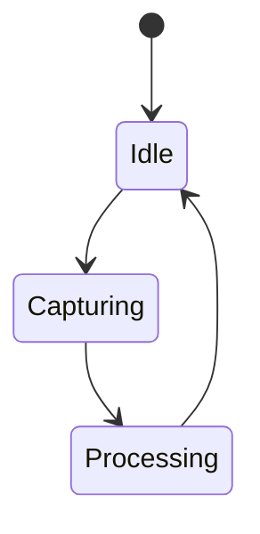
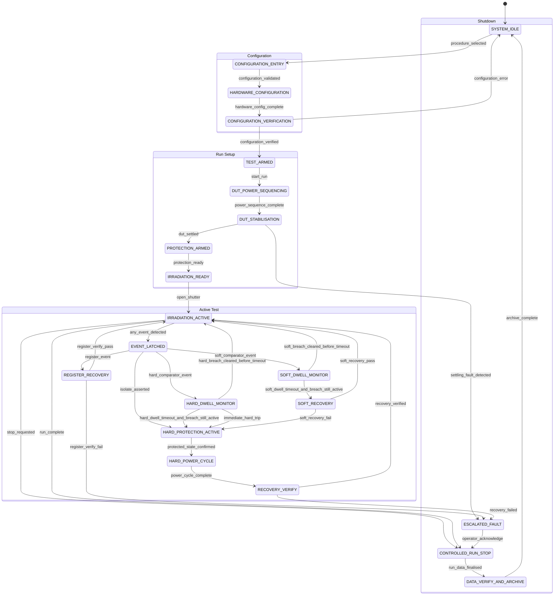
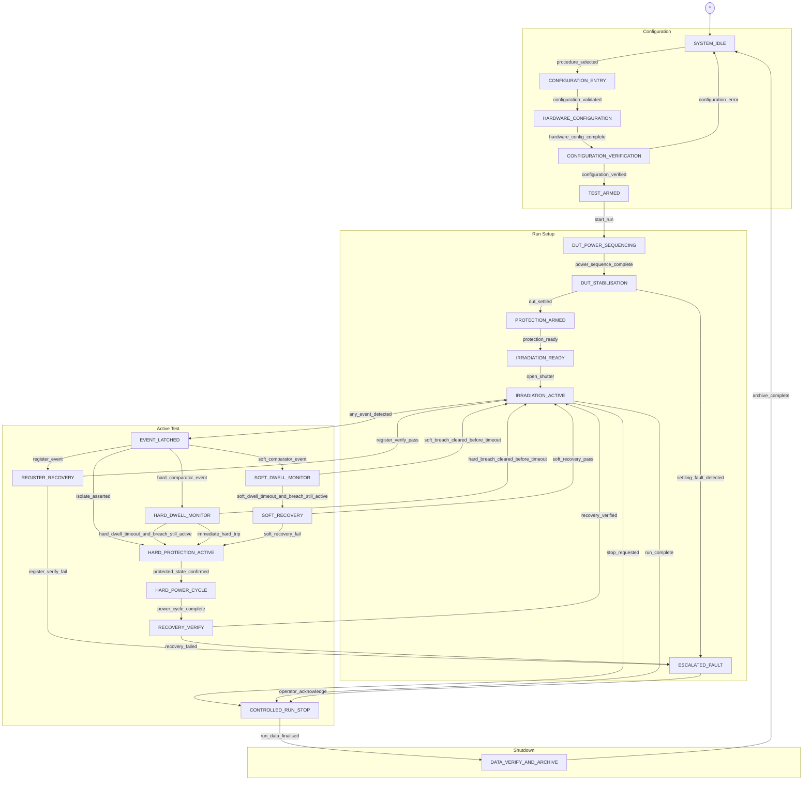

# Mermaid Diagram in Draw.io
Date (UTC): 2026-05-16 19:06
Conversation ID: 6a08c029-b4a0-83eb-9cfc-8f0ee5b49a7b
Source file: Conversations__7c20a96482f3aa11fccee3586429b7a503a5350734f19c55cb3e538cc195527e-chatgpt-0001-part-0001/conversations-007.json

[M1] ME (2026-05-16 19:06):
How do you use draw up to make a mermaid diagram from text 

[M2] AI (2026-05-16 19:06):
If you mean using entity["software","draw.io","diagramming software by JGraph"] / diagrams.net with Mermaid text, the workflow is quite straightforward now.

## In diagrams.net / draw.io

1. Open: urldiagrams.nethttps://www.diagrams.net  
2. Create a blank diagram.
3. Go to:

`Arrange → Insert → Advanced → Mermaid`

4. Paste Mermaid syntax into the editor box.
5. Press **Insert**.

The diagram is then generated and can usually be:
- moved around,
- styled,
- exported as PNG/SVG/PDF,
- or converted back into editable shapes depending on complexity.

---

## Example Mermaid Text

Paste this:

:::writing{variant="document" id="48271"}
flowchart TD
    A[Detector] --> B[Headboard]
    B --> C[Clock & Bias Electronics]
    B --> D[Scope Card Capture]
    D --> E[Rameses]
:::

You’ll get a simple block flow diagram.

---

## Common Diagram Types

### Flowchart

:::writing{variant="document" id="51724"}
flowchart LR
    A[Power Supply] --> B[Bias Board]
    B --> C[CCD]
    C --> D[Digitiser]
:::

### Sequence Diagram

:::writing{variant="document" id="60418"}
sequenceDiagram
    User->>Controller: Start Capture
    Controller->>ADC: Trigger
    ADC-->>Controller: Data Ready
    Controller-->>User: Capture Complete
:::

### State Diagram



---

## Useful Mermaid Docs

- urlMermaid Official Docshttps://mermaid.js.org
- urldiagrams.net Mermaid Supporthttps://www.diagrams.net/doc/faq/mermaid-diagram-edit

---

## Practical Tip

For engineering/system architecture work, it helps to first write the system as:
- entities/nodes,
- arrows/interfaces,
- then groupings/subsystems.

For example:

- Detector
- Headboard
- Clock Driver
- Bias Supply
- Digitiser
- PXI Controller

…then translate directly into Mermaid blocks. It becomes very fast once you think in “nodes + directed relationships”.

[M3] ME (2026-05-16 19:10):
[image]
I have some text but it’s not working can you help
[attached file: IMG_4CBA6A41-81D7-4257-A77A-4E93B49B3ACB.jpeg]

[M4] AI (2026-05-16 19:10):
Yes — the problem is visible in the screenshot.

draw.io / Mermaid in your version does **not support the `elk` layout engine**.

This part is causing the failure:

```text
%%{init: {"layout": "elk",
```

The error specifically says:

> Unknown layout algorithm: elk

So either:
- your Mermaid version is older,
- or diagrams.net hasn’t enabled ELK support.

Remove the ELK initialisation block completely.

---

## What to change

You probably have something like this at the top:

:::writing{variant="document" id="38142"}
%%{init: {"layout": "elk", "elk": {"mergeEdges": true}}}%%
stateDiagram-v2
:::

Replace it with simply:

:::writing{variant="document" id="51783"}
stateDiagram-v2
:::

Then keep the rest of your diagram underneath.

---

## Example Working Version

This should import:

:::writing{variant="document" id="68421"}
stateDiagram-v2
    [*] --> SYSTEM_IDLE

    state "Configuration" as CFG {
        SYSTEM_IDLE --> CONFIGURATION_ENTRY : procedure_selected
        CONFIGURATION_ENTRY --> HARDWARE_CONFIGURATION : configuration_validated
        HARDWARE_CONFIGURATION --> CONFIGURATION_VERIFICATION : hardware_config_complete
        CONFIGURATION_VERIFICATION --> TEST_ARMED : configuration_verified
        CONFIGURATION_VERIFICATION --> SYSTEM_IDLE : configuration_error
    }
:::

---

## Another possible issue

I can also see:

```text
direction LR
```

inside a `stateDiagram-v2`.

Some Mermaid implementations don’t like `direction LR` inside nested states.

If it still errors after removing ELK:
- remove `direction LR`
- try again.

---

## Recommended approach

When Mermaid fails in draw.io:

1. Start minimal:
   - only `stateDiagram-v2`
   - 2 states
   - 1 transition

2. Paste/import.

3. Gradually add:
   - nested states
   - labels
   - styling
   - init blocks

That isolates which syntax the embedded Mermaid engine doesn’t support.

The Mermaid engine bundled in draw.io is often behind the latest official Mermaid release.

[M5] ME (2026-05-16 19:13):
%%{init: {"layout": "elk", "elk": {"mergeEdges": true, "nodePlacementStrategy": "LINEAR_SEGMENTS"}}}%%
stateDiagram-v2
    [*] --> SYSTEM_IDLE

    state "Configuration" as CFG {
        direction LR
        SYSTEM_IDLE --> CONFIGURATION_ENTRY: procedure_selected
        CONFIGURATION_ENTRY --> HARDWARE_CONFIGURATION: configuration_validated
        HARDWARE_CONFIGURATION --> CONFIGURATION_VERIFICATION: hardware_config_complete
        CONFIGURATION_VERIFICATION --> TEST_ARMED: configuration_verified
        CONFIGURATION_VERIFICATION --> SYSTEM_IDLE: configuration_error
    }

    state "Run Setup" as RUNSETUP {
        direction LR
        TEST_ARMED --> DUT_POWER_SEQUENCING: start_run
        DUT_POWER_SEQUENCING --> DUT_STABILISATION: power_sequence_complete
        DUT_STABILISATION --> PROTECTION_ARMED: dut_settled
        DUT_STABILISATION --> ESCALATED_FAULT: settling_fault_detected
        PROTECTION_ARMED --> IRRADIATION_READY: protection_ready
        IRRADIATION_READY --> IRRADIATION_ACTIVE: open_shutter
    }

    state "Active Test" as ACTIVE {
        direction LR
        IRRADIATION_ACTIVE --> EVENT_LATCHED: any_event_detected
        IRRADIATION_ACTIVE --> CONTROLLED_RUN_STOP: stop_requested
        IRRADIATION_ACTIVE --> CONTROLLED_RUN_STOP: run_complete

        EVENT_LATCHED --> SOFT_DWELL_MONITOR: soft_comparator_event
        EVENT_LATCHED --> HARD_DWELL_MONITOR: hard_comparator_event
        EVENT_LATCHED --> REGISTER_RECOVERY: register_event
        EVENT_LATCHED --> HARD_PROTECTION_ACTIVE: isolate_asserted

        SOFT_DWELL_MONITOR --> IRRADIATION_ACTIVE: soft_breach_cleared_before_timeout
        SOFT_DWELL_MONITOR --> SOFT_RECOVERY: soft_dwell_timeout_and_breach_still_active

        HARD_DWELL_MONITOR --> IRRADIATION_ACTIVE: hard_breach_cleared_before_timeout
        HARD_DWELL_MONITOR --> HARD_PROTECTION_ACTIVE: hard_dwell_timeout_and_breach_still_active
        HARD_DWELL_MONITOR --> HARD_PROTECTION_ACTIVE: immediate_hard_trip

        REGISTER_RECOVERY --> IRRADIATION_ACTIVE: register_verify_pass
        REGISTER_RECOVERY --> ESCALATED_FAULT: register_verify_fail

        SOFT_RECOVERY --> IRRADIATION_ACTIVE: soft_recovery_pass
        SOFT_RECOVERY --> HARD_PROTECTION_ACTIVE: soft_recovery_fail

        HARD_PROTECTION_ACTIVE --> HARD_POWER_CYCLE: protected_state_confirmed
        HARD_POWER_CYCLE --> RECOVERY_VERIFY: power_cycle_complete
        RECOVERY_VERIFY --> IRRADIATION_ACTIVE: recovery_verified
        RECOVERY_VERIFY --> ESCALATED_FAULT: recovery_failed
    }

    state "Shutdown" as SHUTDOWN {
        direction LR
        ESCALATED_FAULT --> CONTROLLED_RUN_STOP: operator_acknowledge
        CONTROLLED_RUN_STOP --> DATA_VERIFY_AND_ARCHIVE: run_data_finalised
        DATA_VERIFY_AND_ARCHIVE --> SYSTEM_IDLE: archive_complete
    }


[M6] AI (2026-05-16 19:13):
Use this cleaned version in draw.io. I’ve removed the unsupported `elk` line and the internal `direction LR` lines:



One more thing: your nested state blocks are mostly being used as visual groupings, but some transitions jump between groups. Mermaid can be fussy with that. If draw.io still complains, the more robust option is to use a **flowchart** instead of a `stateDiagram-v2`.

[M7] ME (2026-05-16 19:17):
Yes, how can I d that 

[M8] AI (2026-05-16 19:17):
Convert it from `stateDiagram-v2` to `flowchart TD`, then use `subgraph` for the group boxes.

Paste this into draw.io’s Mermaid insert box:



In draw.io:

`Arrange → Insert → Advanced → Mermaid`

Paste that in, then **Insert**.

This version is much more likely to work because `flowchart` + `subgraph` is better supported than complex nested `stateDiagram-v2`.

[M9] ME (2026-05-16 19:20):
[image]
[attached file: IMG_FE45FA8A-45FA-4D97-804D-143B15BC22FB.jpeg]

[M10] AI (2026-05-16 19:20):
That’s actually a good sign — it’s now parsing successfully. The problem has moved from **syntax failure** to **layout explosion**.

What’s happening is:
- Mermaid auto-layout is trying to route every return path,
- several nodes fan back into `IRRADIATION_ACTIVE`,
- and the graph becomes a spaghetti bundle.

You now need to structure the flowchart for layout, not syntax.

## Easiest fix: switch to Left-to-Right

Change:

```text id="88j6ns"
flowchart TD
```

to:

```text id="97o02l"
flowchart LR
```

That alone will massively improve it.

---

## Next improvement: reduce long return arrows

This section is the main culprit:

```text id="ybhlp6"
SOFT_DWELL_MONITOR --> IRRADIATION_ACTIVE
HARD_DWELL_MONITOR --> IRRADIATION_ACTIVE
REGISTER_RECOVERY --> IRRADIATION_ACTIVE
SOFT_RECOVERY --> IRRADIATION_ACTIVE
RECOVERY_VERIFY --> IRRADIATION_ACTIVE
```

All roads returning to one central node causes huge routing overlap.

Instead introduce a common return node:

Paste this replacement inside ACTIVE:

:::writing{variant="document" id="21478"}
RETURN_TO_TEST[RETURN_TO_TEST]

SOFT_DWELL_MONITOR -->|soft_breach_cleared_before_timeout| RETURN_TO_TEST
HARD_DWELL_MONITOR -->|hard_breach_cleared_before_timeout| RETURN_TO_TEST
REGISTER_RECOVERY -->|register_verify_pass| RETURN_TO_TEST
SOFT_RECOVERY -->|soft_recovery_pass| RETURN_TO_TEST
RECOVERY_VERIFY -->|recovery_verified| RETURN_TO_TEST

RETURN_TO_TEST --> IRRADIATION_ACTIVE
:::

This dramatically cleans the geometry.

---

## Also add direction inside subgraphs

Mermaid flowcharts support this much better than state diagrams.

Example:

:::writing{variant="document" id="55193"}
subgraph ACTIVE[Active Test]
direction LR
:::

Add `direction LR` immediately after every `subgraph`.

---

## Final structure recommendation

You’re really modelling:
- nominal operational flow,
- event handling,
- recovery logic,
- shutdown/escalation.

That is usually clearer as:
1. top-level operational flow,
2. separate event/recovery sub-diagram.

Right now everything is in one graph, which is why it becomes visually dense.

A very engineering-review-friendly approach is:

- Diagram 1 — nominal lifecycle
- Diagram 2 — event escalation/recovery
- Diagram 3 — protection state machine

Rather than one mega-diagram.

That also maps much better into requirement traceability and CDR discussion.

[M11] ME (2026-05-16 19:23):
Ut was spljt inti 4 pa nels 

[M12] AI (2026-05-16 19:23):
Yes — that’s the `subgraph` boxes becoming 4 big panels:

1. Configuration  
2. Run Setup  
3. Active Test  
4. Shutdown  

That is expected from this structure:

```mermaid
subgraph CFG[Configuration]
...
end
```

If you don’t want panels, remove the `subgraph ... end` wrappers and keep the arrows only.

Better option: keep the panels, but make them flow left-to-right:

```mermaid
flowchart LR
```

and inside each panel:

```mermaid
subgraph CFG[Configuration]
direction TB
...
end
```

So the whole diagram moves **left-to-right**, while each panel is internally **top-to-bottom**. That usually looks much cleaner.

Use:

```mermaid
flowchart LR
```

Then each section like:

```mermaid
subgraph CFG[Configuration]
direction TB
    SYSTEM_IDLE -->|procedure_selected| CONFIGURATION_ENTRY
    CONFIGURATION_ENTRY -->|configuration_validated| HARDWARE_CONFIGURATION
end
```

So: **LR for the big process**, **TB inside each panel**.

[M13] ME (2026-05-16 19:23):
Can you do anything?

[M14] AI (2026-05-16 19:23):
Yes. I’d simplify it into a **reviewable 4-panel flowchart** and remove the worst long return paths.

Paste this version into draw.io Mermaid:

```mermaid
flowchart LR

    START([Start]) --> SYSTEM_IDLE[SYSTEM_IDLE]

    subgraph CFG[1. Configuration]
    direction TB
        SYSTEM_IDLE -->|procedure_selected| CONFIGURATION_ENTRY[CONFIGURATION_ENTRY]
        CONFIGURATION_ENTRY -->|configuration_validated| HARDWARE_CONFIGURATION[HARDWARE_CONFIGURATION]
        HARDWARE_CONFIGURATION -->|hardware_config_complete| CONFIGURATION_VERIFICATION[CONFIGURATION_VERIFICATION]
        CONFIGURATION_VERIFICATION -->|configuration_verified| TEST_ARMED[TEST_ARMED]
        CONFIGURATION_VERIFICATION -->|configuration_error| SYSTEM_IDLE
    end

    subgraph RUN[2. Run Setup]
    direction TB
        TEST_ARMED -->|start_run| DUT_POWER_SEQUENCING[DUT_POWER_SEQUENCING]
        DUT_POWER_SEQUENCING -->|power_sequence_complete| DUT_STABILISATION[DUT_STABILISATION]
        DUT_STABILISATION -->|dut_settled| PROTECTION_ARMED[PROTECTION_ARMED]
        DUT_STABILISATION -->|settling_fault_detected| ESCALATED_FAULT[ESCALATED_FAULT]
        PROTECTION_ARMED -->|protection_ready| IRRADIATION_READY[IRRADIATION_READY]
        IRRADIATION_READY -->|open_shutter| IRRADIATION_ACTIVE[IRRADIATION_ACTIVE]
    end

    subgraph ACT[3. Active Test]
    direction TB
        IRRADIATION_ACTIVE -->|any_event_detected| EVENT_LATCHED[EVENT_LATCHED]
        IRRADIATION_ACTIVE -->|stop_requested / run_complete| CONTROLLED_RUN_STOP[CONTROLLED_RUN_STOP]

        EVENT_LATCHED -->|soft_comparator_event| SOFT_DWELL_MONITOR[SOFT_DWELL_MONITOR]
        EVENT_LATCHED -->|hard_comparator_event| HARD_DWELL_MONITOR[HARD_DWELL_MONITOR]
        EVENT_LATCHED -->|register_event| REGISTER_RECOVERY[REGISTER_RECOVERY]
        EVENT_LATCHED -->|isolate_asserted| HARD_PROTECTION_ACTIVE[HARD_PROTECTION_ACTIVE]

        SOFT_DWELL_MONITOR -->|breach_cleared| RETURN_TO_TEST[RETURN_TO_TEST]
        SOFT_DWELL_MONITOR -->|timeout_active| SOFT_RECOVERY[SOFT_RECOVERY]

        HARD_DWELL_MONITOR -->|breach_cleared| RETURN_TO_TEST
        HARD_DWELL_MONITOR -->|timeout_active / immediate_trip| HARD_PROTECTION_ACTIVE

        REGISTER_RECOVERY -->|verify_pass| RETURN_TO_TEST
        REGISTER_RECOVERY -->|verify_fail| ESCALATED_FAULT

        SOFT_RECOVERY -->|recovery_pass| RETURN_TO_TEST
        SOFT_RECOVERY -->|recovery_fail| HARD_PROTECTION_ACTIVE

        HARD_PROTECTION_ACTIVE -->|confirmed| HARD_POWER_CYCLE[HARD_POWER_CYCLE]
        HARD_POWER_CYCLE -->|complete| RECOVERY_VERIFY[RECOVERY_VERIFY]
        RECOVERY_VERIFY -->|verified| RETURN_TO_TEST
        RECOVERY_VERIFY -->|failed| ESCALATED_FAULT

        RETURN_TO_TEST --> IRRADIATION_ACTIVE
    end

    subgraph SHUT[4. Shutdown / Archive]
    direction TB
        ESCALATED_FAULT -->|operator_acknowledge| CONTROLLED_RUN_STOP
        CONTROLLED_RUN_STOP -->|run_data_finalised| DATA_VERIFY_AND_ARCHIVE[DATA_VERIFY_AND_ARCHIVE]
        DATA_VERIFY_AND_ARCHIVE -->|archive_complete| SYSTEM_IDLE
    end
```



This should give you four panels left-to-right, with less horrible arrow routing. The key trick is `RETURN_TO_TEST`, which stops five separate arrows all looping back into `IRRADIATION_ACTIVE`.

[M15] ME (2026-05-16 19:27):
[image]
Delete cer thie yh?
[attached file: IMG_FABB8134-9894-4E89-A910-6986E7348A5F.jpeg]

[M16] AI (2026-05-16 19:27):
Yes — delete the example placeholder text completely.

That bit:

```text id="jkr67u"
graph TD;
A-->B;
A-->C;
B-->D;
C-->D;
```

is just the demo example.

Replace all of it with the Mermaid code I sent earlier.

So:

1. Select everything in that box
2. Delete it
3. Paste the new full diagram
4. Press Insert

Also — your example currently says:

```text id="5czx2i"
graph TD;
```

but the improved version starts with:

```text id="wn0zzx"
flowchart LR
```

So make sure you replace the whole thing, not append underneath.

[M17] ME (2026-05-16 19:28):
[image]
Better, still very long 
[attached file: IMG_A06A9075-61A7-470E-9684-5006EDD28F17.jpeg]

[M18] AI (2026-05-16 19:28):
Yes — now you’re at the “Mermaid is technically working but aesthetically struggling” stage.

The diagram is long because:
- node names are extremely verbose,
- every transition label is long,
- and Mermaid spaces nodes based on text width.

You need abstraction now.

## Biggest improvement

Shorten node labels visually while keeping semantic meaning.

Instead of:

```text id="fd9p0y"
CONFIGURATION_VERIFICATION
```

use:

```text id="07q3xh"
CFG_VERIFY
```

Instead of:

```text id="zjlwm5"
HARD_PROTECTION_ACTIVE
```

use:

```text id="b0omxk"
HARD_PROTECT
```

Instead of:

```text id="q8r53l"
DATA_VERIFY_AND_ARCHIVE
```

use:

```text id="c8c6nl"
ARCHIVE
```

That alone can reduce width by ~50%.

---

## Even better: use display labels

Mermaid allows:

```mermaid id="w40v3h"
CFG_VERIFY["Configuration Verify"]
```

So:
- internal node ID stays short,
- displayed text stays readable.

Example:

```mermaid id="jldyl3"
CFG_VERIFY["Configuration Verify"]
HARD_PROTECT["Hard Protection"]
RETURN["Return To Test"]
```

This is the professional approach.

---

## Also shorten arrow labels

Instead of:

```text id="s2k0eb"
soft_breach_cleared_before_timeout
```

use:

```text id="9ys3is"
soft_clear
```

Instead of:

```text id="6r13nh"
hard_dwell_timeout_and_breach_still_active
```

use:

```text id="y8j7hf"
hard_timeout
```

Long labels are one of the biggest causes of width explosion.

---

## Real engineering recommendation

You’re trying to encode:
- lifecycle,
- event handling,
- protection escalation,
- recovery,
- archive/shutdown,

all in one figure.

For a CDR/design review, split it:

### Diagram 1
Nominal operational flow

```text id="m1z3s2"
Idle → Configure → Arm → Irradiate → Stop → Archive
```

### Diagram 2
Event handling and recovery

```text id="blbgum"
Event → Soft/Hard → Recovery → Resume/Escalate
```

### Diagram 3
Protection/power-cycle behaviour

This will look vastly more professional than one mega-flowchart.

Because right now Mermaid is faithfully drawing complexity that really should be hierarchical documentation.

[M19] ME (2026-05-16 19:30):
Injjsy ea t ti get nt hrad riunr jt slk sbd rekate jt bsck tie yat i wasnfij g earlier 

[M20] AI (2026-05-16 19:30):
Yes — exactly. You’re basically saying:

> “I just want the earlier style back where it stacked and relaxed instead of stretching forever sideways.”

That’s the right instinct.

Change this:

```text id="40r9do"
flowchart LR
```

back to:

```text id="xg15c0"
flowchart TD
```

That forces a vertical layout again.

BUT keep:
- the simplified node names,
- the `RETURN_TO_TEST` node,
- and the subgraphs.

That gives:
- stacked panels,
- cleaner routing,
- less spaghetti.

The reason the earlier one “felt better” is because:
- Mermaid handles dense state logic much better vertically,
- horizontal (`LR`) is great for pipelines,
- but bad for highly recursive recovery logic.

So your sweet spot is:

```mermaid id="l3o4s6"
flowchart TD
```

with:

```mermaid id="xk7jlg"
subgraph ACTIVE[Active Test]
direction TB
```

inside each section.

That creates:
- vertically stacked panels,
- internally top-down flow,
- more compact geometry,
- and much shorter arrows.

You were actually closer earlier than you thought — the issue wasn’t the panels, it was the massive recursive fan-back arrows.

[M21] ME (2026-05-16 19:32):
[image]
[attached file: IMG_49F47E66-410A-4003-86F8-44A68755E16D.jpeg]

[M22] AI (2026-05-16 19:32):
You’re very close now. The remaining issue is that Mermaid is still trying to draw large loop-back arrows around the outside of the panel.

The big ugly loops are mainly these:

```text id="4fsqdr"
RETURN_TO_TEST --> IRRADIATION_ACTIVE
```

and:

```text id="vv7w2g"
ESCALATED_FAULT --> CONTROLLED_RUN_STOP
```

They force the renderer to wrap huge paths around the diagram.

## Best fix now

Inside the ACTIVE section, stop drawing returns all the way back upward.

Instead make it linear.

Replace this:

```text id="d0z8zh"
RETURN_TO_TEST --> IRRADIATION_ACTIVE
```

with:

```text id="w0r90z"
RETURN_TO_TEST --> CONTINUE_RUN
```

and treat it as a terminal continuation node.

So visually:

```text id="8f1n3k"
RECOVERY_VERIFY --> RETURN_TO_TEST --> CONTINUE_RUN
```

instead of physically looping back.

That’s what engineers often do in review diagrams:
- logical continuation,
- not literal geometric recursion.

---

## Even cleaner

Use off-page connectors conceptually:

```text id="b0yhj6"
CONTINUE_RUN([Resume Irradiation])
```

and:

```text id="jmjlwm"
FAULT_EXIT([Escalated Fault])
```

instead of routing giant arrows.

---

## Why this works

Right now Mermaid is being mathematically honest:
- your system is recursive,
- therefore it draws recursion literally.

But review diagrams usually prioritise:
- readability,
- operational understanding,
- escalation visibility,

over exact cyclic geometry.

So abstracting the loop is the correct engineering-diagram approach, not a workaround.

[M23] ME (2026-05-16 19:35):
I thi k im gij g ti ksy fien s fre blicks circuit wise it hello me. Do you know how u can install celestial library from
Git her b

[M24] AI (2026-05-16 19:35):
I think you mean using entity["software","Fritzing","electronic prototyping software"] or a similar block/circuit visual tool instead of Mermaid, because it feels more natural for “circuit-style” thinking. That makes sense — Mermaid is better for logic/state flow than visually intuitive engineering schematics.

For the “Celestial library from GitHub” part, I suspect you may mean a custom component library/package for:
- entity["software","KiCad","EDA software"],
- entity["software","Fritzing","electronic prototyping software"],
- or entity["software","EasyEDA","EDA software"].

I need the actual GitHub repo or exact library name to give precise steps, because “Celestial library” could refer to several different projects.

Usually the install flow from urlGitHubhttps://github.com is:

1. Download ZIP from the repo
2. Extract it
3. Copy library files into the tool’s library folder
4. Add the library path inside the application settings/preferences

For example, in entity["software","KiCad","EDA software"]:

- Download `.kicad_sym` / `.pretty` libraries
- Open:
  - Preferences → Manage Symbol Libraries
  - Preferences → Manage Footprint Libraries
- Add the downloaded paths

If you send:
- the GitHub link,
- or a screenshot,
- or tell me which software you’re using,

I can walk you through it exactly.

[M25] ME (2026-05-16 20:05):
Back tingooe chat, s
Can visik hsnfke then yh 

[M26] AI (2026-05-16 20:05):
Yes — visually hand-building it in blocks can absolutely help.

What you’re running into is that Mermaid is:
- great for quick logical structure,
- but poor once the flow becomes highly recursive and engineering-heavy.

For your kind of system, manually arranging blocks often produces a much clearer review diagram because you can:
- intentionally place recovery paths,
- minimise crossings,
- visually separate nominal vs fault flow,
- and control emphasis.

A good approach in entity["software","draw.io","diagramming software by JGraph"] is:

1. Create four large containers:
   - Configuration
   - Run Setup
   - Active Test
   - Shutdown

2. Inside each:
   - manually place process blocks,
   - keep nominal flow vertical,
   - put fault handling on one side,
   - put recovery on the opposite side.

3. Use:
   - solid arrows for nominal flow,
   - dashed arrows for recovery/fault returns.

4. Instead of giant loopbacks:
   - use labelled continuation nodes like:
     - “Resume Irradiation”
     - “Escalated Fault”
     - “Shutdown Path”

That’s how many real engineering review diagrams are drawn — they stop being mathematically pure state machines and become communication tools.

Honestly your system structure itself is fine. The problem is just that Mermaid auto-layout isn’t sophisticated enough for this density of cyclic behaviour.

[M27] ME (2026-05-16 20:05):
Vision

[M28] AI (2026-05-16 20:05):
If by “Vision” you mean something more visual/interactive for building these flows, then yes — a visual node-based approach is probably a much better fit for you than raw Mermaid text.

A few good options:

## Best fit for your workflow

### entity["software","draw.io","diagramming software by JGraph"]
Probably still the best balance.

Use:
- containers/swimlanes,
- manual block placement,
- orthogonal connectors,
- colour-coded fault paths.

This gives you engineering-review-quality diagrams.

---

### entity["software","Microsoft Visio","diagramming software"]
Very good for:
- state/process diagrams,
- automatic alignment,
- large review documents.

Better than Mermaid for complex recursive logic.

---

### entity["software","yEd","graph editor software"]
Excellent auto-layout engine.

Very underrated for:
- state machines,
- complex graph routing,
- layered engineering flows.

Its hierarchical layout is far beyond Mermaid.

---

### entity["software","Excalidraw","virtual whiteboard software"]
Good if you want:
- rapid thinking,
- rough conceptual architecture,
- whiteboard feel.

Less formal.

---

## For your exact use case

I’d probably do:

### Phase 1 — whiteboard logic
Use:
- Excalidraw
- or draw.io freehand

### Phase 2 — formal engineering diagram
Move to:
- draw.io
- or Visio

### Phase 3 — requirement traceability
Split into:
- operational flow,
- protection flow,
- recovery

[M29] ME (2026-05-16 20:05):
Visio 

[M30] AI (2026-05-16 20:05):
image_group{"layout":"carousel","aspect_ratio":"16:9","query":["Microsoft Visio interface flowchart","Microsoft Visio state diagram example","Microsoft Visio engineering workflow diagram","Microsoft Visio swimlane diagram"],"num_per_query":1}

entity["software","Microsoft Visio","diagramming software"] is much better suited to what you’re trying to do now.

You’ve essentially outgrown Mermaid for this diagram complexity.

## Why Visio will feel better

You can:
- drag blocks exactly where you want,
- manually control recovery loops,
- use proper orthogonal routing,
- create containers/swimlanes,
- and stop the renderer from “fighting” your intended layout.

That’s ideal for:
- fault recovery logic,
- irradiation state flow,
- protection escalation,
- engineering review material.

---

## Recommended structure in Visio

### Use Containers

Create four large containers:

1. Configuration
2. Run Setup
3. Active Test
4. Shutdown / Archive

Visio handles this extremely well.

---

## Inside each container

### Keep nominal flow vertical

```text id="y00k7l"
Top → Bottom
```

Example:

```text id="2xikm5"
IRRADIATION_READY
↓
IRRADIATION_ACTIVE
↓
EVENT_LATCHED
```

---

## Put recovery logic on the sides

Example:

```text id="r76bgt"
Soft Recovery        Main Flow        Hard Protection
```

This avoids giant loopbacks.

---

## Use connector styles intentionally

- Solid line = nominal flow
- Dashed line = recovery/exception
- Red = protection/fault
- Green = successful recovery

That massively improves readability.

---

## Key Visio feature you’ll like

### “Dynamic Connectors”

Use:
- Home → Connector Tool

Then:
- drag blocks,
- Visio reroutes lines automatically,
- but still allows manual control.

Far superior to Mermaid auto-routing.

---

## Suggested stencil types

Start with:
- Basic Flowchart
- Cross-Functional Flowchart
- Containers

Avoid BPMN initially — overkill for this.

---

## Important recommendation

Do not make one mega-diagram.

You’ll get a much stronger engineering review pack with:

### Diagram 1
Operational lifecycle

### Diagram 2
Event detection and dwell handling

### Diagram 3
Protection escalation and recovery

### Diagram 4
Data archive and shutdown behaviour

That mirrors how reviewers mentally process the system anyway.

[M31] ME (2026-05-16 20:06):
Could
Youngest lrsst give me the sattng frame? How ciuid we do that? Excel nao the I follow?

[M32] AI (2026-05-16 20:06):
Yes — and that’s actually a very strong approach.

You can use entity["software","Microsoft Excel","spreadsheet software"] to define the *structural framework* first, then build the Visio diagram from it.

That works especially well for engineering systems because the logic becomes reviewable before the graphics do.

## A good workflow

### Step 1 — Build a transition table in Excel

Instead of drawing immediately, define:

| Current State | Event/Condition | Next State | Category |
|---|---|---|---|
| SYSTEM_IDLE | procedure_selected | CONFIGURATION_ENTRY | nominal |
| CONFIGURATION_ENTRY | configuration_validated | HARDWARE_CONFIGURATION | nominal |
| IRRADIATION_ACTIVE | any_event_detected | EVENT_LATCHED | event |
| HARD_DWELL_MONITOR | immediate_hard_trip | HARD_PROTECTION_ACTIVE | protection |

This becomes your authoritative behaviour table.

---

## Why this helps

You can:
- review completeness,
- detect missing states,
- identify dead ends,
- see recursive loops,
- classify behaviour,
- and trace requirements.

Before even drawing anything.

That’s actually closer to proper systems engineering methodology.

---

## Then derive the Visio layout

Use the Excel table to group into sections:

### Configuration
- SYSTEM_IDLE
- CONFIGURATION_ENTRY
- HARDWARE_CONFIGURATION

### Active Test
- IRRADIATION_ACTIVE
- EVENT_LATCHED
- SOFT_DWELL_MONITOR

etc.

Now the diagram becomes a *visualisation of structured data*, not random manual drawing.

---

## Even better structure

Add columns like:

| State | Type | Panel | Criticality | Recovery Path |
|---|---|---|---|---|
| IRRADIATION_ACTIVE | operational | Active Test | medium | yes |
| HARD_PROTECTION_ACTIVE | protection | Active Test | critical | yes |
| ESCALATED_FAULT | terminal | Shutdown | critical | no |

Now you can:
- colour automatically,
- filter views,
- split diagrams cleanly,
- generate review tables.

---

## This is the key insight

Your system is already behaving like a formal state machine.

So:
- Excel = system definition layer
- Visio = presentation layer

That’s a very mature engineering workflow.

[M33] ME (2026-05-16 20:07):
Ok, can you draft simethjn?

[M34] AI (2026-05-16 20:07):
Yes — draft this as an Excel framework you can copy straight into a sheet.

:::writing{variant="document" id="73942"}
# State Machine Definition Framework

## Sheet 1 — State Register

| State ID | Display Name | Panel / Phase | State Type | Criticality | Description | Expected Entry Condition | Expected Exit Condition | Recovery Required? | Notes |
|---|---|---|---|---|---|---|---|---|---|
| SYSTEM_IDLE | System Idle | Configuration | Stable | Low | System is safe, powered as required, and awaiting operator action. | System initialised or archive complete. | Procedure selected. | No | Default safe state. |
| CONFIGURATION_ENTRY | Configuration Entry | Configuration | Process | Low | Operator or software enters selected test procedure configuration. | Procedure selected. | Configuration validated. | No | May include procedure ID, DUT ID and test mode. |
| HARDWARE_CONFIGURATION | Hardware Configuration | Configuration | Process | Medium | Hardware settings, routing, thresholds and protection limits are applied. | Configuration validated. | Hardware configuration complete. | No | Includes PSU, comparator, shutter and monitoring setup. |
| CONFIGURATION_VERIFICATION | Configuration Verification | Configuration | Decision | Medium | System verifies that applied configuration is consistent and safe. | Hardware configuration complete. | Configuration verified or configuration error. | Yes | Failed verification returns system to idle. |
| TEST_ARMED | Test Armed | Run Setup | Stable | Medium | Test is configured and ready for DUT power sequencing. | Configuration verified. | Start run command. | No | Operator-visible armed state. |
| DUT_POWER_SEQUENCING | DUT Power Sequencing | Run Setup | Process | Medium | DUT supplies are enabled in controlled sequence. | Start run command. | Power sequence complete. | Yes | Faults should inhibit progression. |
| DUT_STABILISATION | DUT Stabilisation | Run Setup | Process | Medium | DUT is allowed to settle before irradiation/protection arm. | Power sequence complete. | DUT settled or settling fault. | Yes | Settling fault escalates to fault handling. |
| PROTECTION_ARMED | Protection Armed | Run Setup | Stable | High | Protection monitoring is confirmed active. | DUT settled. | Protection ready. | Yes | Required before irradiation. |
| IRRADIATION_READY | Irradiation Ready | Run Setup | Stable | High | System is ready to open shutter/start irradiation exposure. | Protection ready. | Open shutter. | Yes | Final pre-active state. |
| IRRADIATION_ACTIVE | Irradiation Active | Active Test | Operational | High | DUT is under active irradiation/test exposure. | Shutter opened or recovery verified. | Event detected, stop requested, or run complete. | Yes | Central active state. |
| EVENT_LATCHED | Event Latched | Active Test | Decision | High | A comparator, register, or protection-related event has been detected and latched. | Any event detected. | Event classified. | Yes | Branches to soft, hard, register or protection handling. |
| SOFT_DWELL_MONITOR | Soft Dwell Monitor | Active Test | Monitor | Medium | Soft comparator event is monitored for dwell timeout. | Soft comparator event. | Breach cleared or timeout active. | Yes | Cleared events return to test. |
| HARD_DWELL_MONITOR | Hard Dwell Monitor | Active Test | Monitor | High | Hard comparator event is monitored for dwell timeout or immediate trip. | Hard comparator event. | Breach cleared, timeout active, or immediate trip. | Yes | Timeout/immediate trip goes to hard protection. |
| REGISTER_RECOVERY | Register Recovery | Active Test | Recovery | Medium | Register event is checked and recovery/verification attempted. | Register event. | Verify pass or fail. | Yes | Failed verification escalates. |
| SOFT_RECOVERY | Soft Recovery | Active Test | Recovery | Medium | Recovery attempt following soft dwell timeout. | Soft dwell timeout. | Recovery pass or fail. | Yes | Failed recovery escalates to hard protection. |
| HARD_PROTECTION_ACTIVE | Hard Protection Active | Active Test | Protection | Critical | System has asserted isolation/protection state. | Hard trip, timeout, or recovery failure. | Protected state confirmed. | Yes | Safety/protection-dominant state. |
| HARD_POWER_CYCLE | Hard Power Cycle | Active Test | Recovery | Critical | DUT or affected hardware is power cycled under controlled conditions. | Protected state confirmed. | Power cycle complete. | Yes | Must be logged. |
| RECOVERY_VERIFY | Recovery Verify | Active Test | Decision | High | System verifies whether recovery is acceptable. | Power cycle complete. | Recovery verified or failed. | Yes | Pass resumes test; fail escalates. |
| RETURN_TO_TEST | Return To Test | Active Test | Connector | Medium | Logical connector used to avoid multiple diagram loopbacks. | Recovery or transient event cleared. | Resume irradiation active state. | No | Useful for Visio simplification. |
| ESCALATED_FAULT | Escalated Fault | Shutdown / Fault | Critical | Critical | Fault requires operator acknowledgement before controlled stop. | Recovery failed or settling/register failure. | Operator acknowledged. | Yes | Should trigger clear log/audit record. |
| CONTROLLED_RUN_STOP | Controlled Run Stop | Shutdown / Archive | Process | High | Run is stopped in a controlled and logged manner. | Stop requested, run complete, or acknowledged fault. | Run data finalised. | No | Common stop path. |
| DATA_VERIFY_AND_ARCHIVE | Data Verify and Archive | Shutdown / Archive | Process | Medium | Run data is checked, finalised and archived. | Controlled stop complete. | Archive complete. | No | Returns to idle. |
:::

:::writing{variant="document" id="24851"}
## Sheet 2 — Transition Register

| From State | Event / Condition | To State | Transition Type | Priority | Logged? | Requirement Link | Notes |
|---|---|---|---|---|---|---|---|
| SYSTEM_IDLE | procedure_selected | CONFIGURATION_ENTRY | Nominal | Normal | Yes | TBD | Start selected test procedure. |
| CONFIGURATION_ENTRY | configuration_validated | HARDWARE_CONFIGURATION | Nominal | Normal | Yes | TBD | Configuration accepted. |
| HARDWARE_CONFIGURATION | hardware_config_complete | CONFIGURATION_VERIFICATION | Nominal | Normal | Yes | TBD | Hardware settings applied. |
| CONFIGURATION_VERIFICATION | configuration_verified | TEST_ARMED | Nominal | Normal | Yes | TBD | System ready to arm. |
| CONFIGURATION_VERIFICATION | configuration_error | SYSTEM_IDLE | Fault / Reject | High | Yes | TBD | Invalid configuration returns to idle. |
| TEST_ARMED | start_run | DUT_POWER_SEQUENCING | Nominal | Normal | Yes | TBD | Operator starts run. |
| DUT_POWER_SEQUENCING | power_sequence_complete | DUT_STABILISATION | Nominal | Normal | Yes | TBD | DUT power applied. |
| DUT_STABILISATION | dut_settled | PROTECTION_ARMED | Nominal | Normal | Yes | TBD | DUT settled successfully. |
| DUT_STABILISATION | settling_fault_detected | ESCALATED_FAULT | Fault | High | Yes | TBD | Settling failure requires fault handling. |
| PROTECTION_ARMED | protection_ready | IRRADIATION_READY | Nominal | Normal | Yes | TBD | Protection confirmed. |
| IRRADIATION_READY | open_shutter | IRRADIATION_ACTIVE | Nominal | High | Yes | TBD | Active irradiation begins. |
| IRRADIATION_ACTIVE | any_event_detected | EVENT_LATCHED | Event | High | Yes | TBD | Event captured and latched. |
| IRRADIATION_ACTIVE | stop_requested | CONTROLLED_RUN_STOP | Operator Stop | High | Yes | TBD | Operator-requested stop. |
| IRRADIATION_ACTIVE | run_complete | CONTROLLED_RUN_STOP | Nominal Stop | Normal | Yes | TBD | Planned run completion. |
| EVENT_LATCHED | soft_comparator_event | SOFT_DWELL_MONITOR | Event Branch | Medium | Yes | TBD | Soft comparator event. |
| EVENT_LATCHED | hard_comparator_event | HARD_DWELL_MONITOR | Event Branch | High | Yes | TBD | Hard comparator event. |
| EVENT_LATCHED | register_event | REGISTER_RECOVERY | Event Branch | Medium | Yes | TBD | Register recovery path. |
| EVENT_LATCHED | isolate_asserted | HARD_PROTECTION_ACTIVE | Protection | Critical | Yes | TBD | Immediate protection path. |
| SOFT_DWELL_MONITOR | soft_breach_cleared_before_timeout | RETURN_TO_TEST | Recovery / Return | Medium | Yes | TBD | Transient cleared. |
| SOFT_DWELL_MONITOR | soft_dwell_timeout_and_breach_still_active | SOFT_RECOVERY | Recovery | Medium | Yes | TBD | Soft recovery required. |
| HARD_DWELL_MONITOR | hard_breach_cleared_before_timeout | RETURN_TO_TEST | Recovery / Return | High | Yes | TBD | Hard breach cleared before timeout. |
| HARD_DWELL_MONITOR | hard_dwell_timeout_and_breach_still_active | HARD_PROTECTION_ACTIVE | Protection | Critical | Yes | TBD | Hard protection required. |
| HARD_DWELL_MONITOR | immediate_hard_trip | HARD_PROTECTION_ACTIVE | Protection | Critical | Yes | TBD | Immediate hard trip. |
| REGISTER_RECOVERY | register_verify_pass | RETURN_TO_TEST | Recovery / Return | Medium | Yes | TBD | Register recovery successful. |
| REGISTER_RECOVERY | register_verify_fail | ESCALATED_FAULT | Fault | High | Yes | TBD | Register recovery failed. |
| SOFT_RECOVERY | soft_recovery_pass | RETURN_TO_TEST | Recovery / Return | Medium | Yes | TBD | Soft recovery successful. |
| SOFT_RECOVERY | soft_recovery_fail | HARD_PROTECTION_ACTIVE | Protection | Critical | Yes | TBD | Soft recovery failed. |
| HARD_PROTECTION_ACTIVE | protected_state_confirmed | HARD_POWER_CYCLE | Recovery | Critical | Yes | TBD | Protection state confirmed. |
| HARD_POWER_CYCLE | power_cycle_complete | RECOVERY_VERIFY | Recovery | Critical | Yes | TBD | Power cycle completed. |
| RECOVERY_VERIFY | recovery_verified | RETURN_TO_TEST | Recovery / Return | High | Yes | TBD | Recovery accepted. |
| RECOVERY_VERIFY | recovery_failed | ESCALATED_FAULT | Fault | Critical | Yes | TBD | Recovery failed. |
| RETURN_TO_TEST | resume_test | IRRADIATION_ACTIVE | Logical Return | Medium | Yes | TBD | Diagram connector, may be shown as “Resume Irradiation”. |
| ESCALATED_FAULT | operator_acknowledge | CONTROLLED_RUN_STOP | Fault Stop | Critical | Yes | TBD | Operator acknowledges fault. |
| CONTROLLED_RUN_STOP | run_data_finalised | DATA_VERIFY_AND_ARCHIVE | Nominal | Normal | Yes | TBD | Data finalisation complete. |
| DATA_VERIFY_AND_ARCHIVE | archive_complete | SYSTEM_IDLE | Nominal | Normal | Yes | TBD | System returns to idle. |
:::

:::writing{variant="document" id="59618"}
## Sheet 3 — Visio Layout Guide

| Panel | Purpose | Recommended Position | Main Flow Direction | Side Branches | Notes |
|---|---|---|---|---|---|
| Configuration | Procedure selection and configuration validation | Top-left or first swimlane | Top to bottom | Configuration error returns to idle | Keep this simple and non-dense. |
| Run Setup | DUT power-up, settling, and protection arming | After Configuration | Top to bottom | Settling fault exits to Escalated Fault | Show protection arming clearly before irradiation. |
| Active Test | Irradiation, event detection, dwell monitoring, recovery and protection | Main central panel | Top to bottom | Soft handling left, hard protection right | This is the densest part; avoid literal loopbacks where possible. |
| Shutdown / Archive | Controlled stop, data finalisation, archive and return to idle | Final panel or bottom | Top to bottom | Fault acknowledgement enters here | Use one common stop path. |

## Visio Styling Rules

| Item | Suggested Style |
|---|---|
| Nominal flow | Solid connector |
| Event branch | Solid connector with event label |
| Recovery return | Dashed connector |
| Protection / fault path | Bold or red connector |
| Stable state | Rounded rectangle |
| Decision / verification state | Diamond or labelled process block |
| Connector node | Small circle or rounded block, e.g. “Return To Test” |
| Critical state | Strong border or warning colour |
| Review note | Callout box attached to state or transition |

## Suggested Diagram Split

| Diagram | Scope |
|---|---|
| Diagram 1 | Overall operational lifecycle: Idle → Configure → Arm → Irradiate → Stop → Archive |
| Diagram 2 | Active test event handling: Event latched → soft/hard/register paths |
| Diagram 3 | Protection and recovery: hard protection → power cycle → verify → resume/escalate |
| Diagram 4 | Shutdown and data archive behaviour |
:::

Start with **Sheet 1 and Sheet 2**. Once those are tidy, Visio becomes much easier because you’re drawing from a controlled transition register rather than inventing the structure on the canvas.
