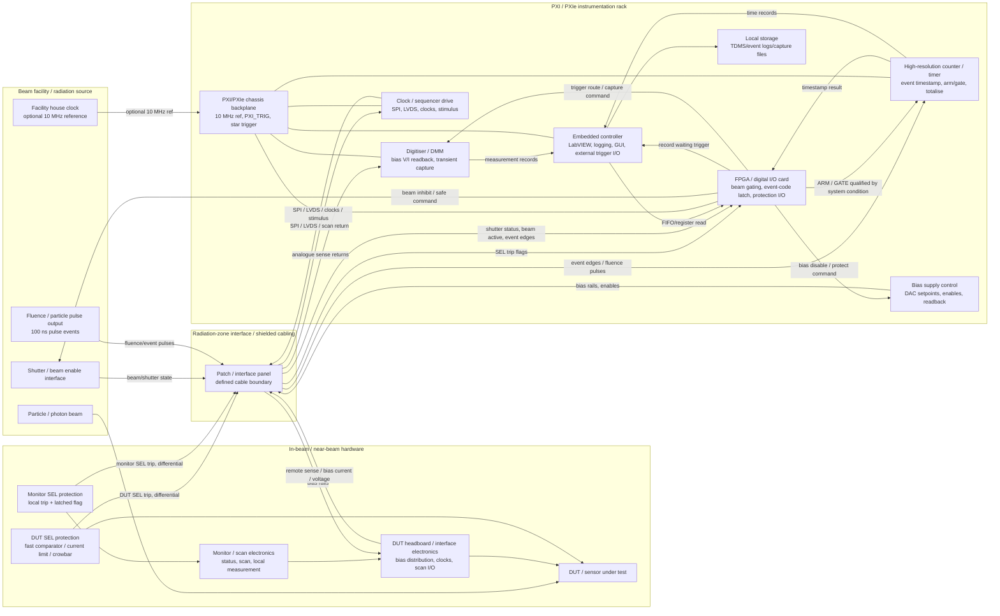

# Radiation System State Machine
Date (UTC): 2026-06-23 19:55
Conversation ID: 6a3ae4b2-3394-83ed-b3e1-d3ddff2994a8
Source file: Conversations__7c20a96482f3aa11fccee3586429b7a503a5350734f19c55cb3e538cc195527e-chatgpt-0001-part-0001/conversations-008.json

[M1] ME (2026-06-23 19:55):
Which chat were we defining radiation system state machines

[M2] AI (2026-06-23 19:55):
That was most likely the chat titled **“External Trigger for Timestamps”** from **2026-06-23 at 18:58**.

In that thread, we discussed:

- LabVIEW and PXI hardware
- External trigger into a controller module
- FPGA output / PXI input
- Sub-second timestamping
- Run-state synchronisation
- Using a trigger/state signal both for **test-mode timing** and **fault-mode indication**
- Logging radiation/test-system metadata such as bias current, event flags, shutter status, fluence/dose counts, and timestamps

That is the same thread where you asked me to **summarise it into a one-page proposal** for improving useful metadata and sub-one-second timestamping.

[M3] ME (2026-06-23 19:55):
There was an older one 

[M4] AI (2026-06-23 19:55):
I’ll look beyond the visible recent thread and try to identify the older conversation by the specific phrases “radiation system”, “state machine”, and related PXI/FPGA wording.

[M5] AI (2026-06-23 19:56):
Yes — the older one was likely around **13–15 May 2026**.

The strongest match is:

**Around 15 May 2026 — radiation/qualification rack + state-machine document**

That chat included:

- Pulling the “whole chat” into a **summarised state-machine document**
- Revisiting/numbering an old **heavy-iron system state diagram**
- A **new setup** / next-generation rack concept
- Radiation or qualification rack instrumentation
- NI PXI-4071 / PXI-style logging
- Event visibility, transient capture, and exposure correlation
- PXI trigger-out / backplane routing
- Synchronised acquisition

There was also a closely related earlier thread around **13 May 2026**, covering:

- “Radiation system”
- FPGA / PXI / LabVIEW-style acquisition architecture
- Digital capture
- Embedded PXI controller with RAID/RAM buffering
- PXIe-6535 / PXIe FPGA-RIO type architecture
- Deterministic fault response and safe-state / interlock behaviour

So I’d search your history for titles or wording around:

**“radiation system”**, **“state machine”**, **“qualification rack”**, **“PXI-4071”**, **“PXI trigger”**, **“heavy iron”**, or **“new setup”**.

The one you mean is probably **not today’s timestamping chat**, but the **mid-May radiation/qualification rack state-machine discussion**.

[M6] ME (2026-06-23 19:57):
Can you regenerate the full synopsis from both of those may chats 

[M7] AI (2026-06-23 19:57):
I’ll reconstruct this from the remembered May threads and the current trigger/timestamping thread, then separate confirmed points from inferred consolidation so it’s useful rather than pretending I can see every line verbatim.

[M8] AI (2026-06-23 19:57):
Below is a regenerated **combined synopsis of the two May chats** about the radiation/qualification system state-machine architecture. I’ve reconstructed it from the older discussion context, so this should be treated as a **technical consolidation**, not a verbatim transcript.

# Radiation System State-Machine / Qualification Rack Synopsis  
**Reconstructed from the May 2026 discussions**

## 1. Overall objective

The May discussions were centred on turning the radiation test setup from a relatively loose PC/logging arrangement into a more deterministic, instrumented, PXI-based qualification rack.

The main aim was to improve:

- event visibility during radiation exposure,
- deterministic fault detection and response,
- traceable state transitions,
- timestamping and synchronised acquisition,
- repeatable qualification sequences,
- recovery behaviour after faults,
- useful metadata capture around bias, exposure, shutter, fluence/dose and system condition.

The broader concept was that the system should behave less like a collection of manually orchestrated instruments and more like a **defined test instrument with an internal state machine**, where every important operating condition is represented by a formal state, event, transition, and logged metadata record.

## 2. System boundary and compliance framing

One of the important points was the system boundary.

Rather than treating the arrangement as a normal Windows PC plus disconnected instruments, the better architecture was framed as an **all-in-one PXI test instrument boundary**.

That matters because the safety, compliance and responsibility boundary becomes clearer. The intended framing was broadly aligned with **IEC 61010-style test and measurement equipment thinking**: the rack should have a defined instrument boundary, clear input/output interfaces, protective behaviour, interlocks, fault response, and documented operating modes.

The rack would therefore be considered a controlled qualification instrument rather than a general-purpose PC performing ad hoc control.

## 3. PXI / FPGA / controller split

A key architectural conclusion was that the embedded controller or LabVIEW/Windows layer should not be responsible for deterministic protection decisions.

The split was roughly:

**FPGA / deterministic hardware layer**

- fast acquisition,
- digital event capture,
- trigger response,
- interlock handling,
- fault detection,
- protection actions,
- state-machine enforcement,
- fault-cycle and recovery sequencing,
- timestamp/event tagging close to the hardware.

**PXI embedded controller / LabVIEW layer**

- configuration,
- recipe selection,
- user interface,
- supervisory control,
- data collation,
- file logging,
- report generation,
- operator acknowledgement,
- non-critical sequencing.

**Storage / buffering layer**

- high-rate circular buffers,
- transient capture,
- event-window extraction,
- structured data streams,
- longer-term logging,
- post-test analysis.

The important conclusion was that **software should not directly “own” the fast protection path**. Windows or the embedded PXI controller may supervise, but the FPGA or deterministic subsystem should be the authority for time-critical states and fault handling.

## 4. Sampling and buffering architecture

Another May point was that software should not be thought of as directly reading raw DDR4 or PXI RAM.

The cleaner architecture was:

**ADCs / digital inputs → sample engine → circular buffer → event extraction → structured software stream**

So the software sees meaningful packets, records, events and timestamps, not raw memory.

A conceptual chain was:

1. analogue and digital signals enter the acquisition cards or FPGA I/O,
2. a deterministic sample engine captures them,
3. data is written to high-speed buffer memory,
4. circular buffering preserves pre-trigger and post-trigger history,
5. events cause extraction windows,
6. extracted records are passed to the controller,
7. controller logs structured files with metadata.

That means if a fault occurs, the system can preserve the period before and after the fault rather than only logging at a low regular rate.

## 5. Digital capture discussion

The May chat discussed high-density digital capture, including something like:

- around **30 parallel digital channels**,
- a **2-second capture window**,
- PXIe-6535 / PXIe-654x-type digital acquisition,
- external sample clocking,
- PXI RAM buffering,
- embedded controller storage,
- PXIe chassis architecture,
- potential RAID-backed storage for larger data sets.

The key point was that digital channels representing mode, status, shutters, exposure flags, fault flags, bias enables, interlocks and device logic can be captured synchronously.

That would let the system reconstruct what actually happened during a radiation event or transient, instead of relying only on slow 1 Hz status logs.

## 6. SPI / serial capture discussion

There was also a branch where you asked what happens if the signal is **purely SPI** rather than many parallel digital lines.

The conclusion was that if the SPI is well formed, then the system could either:

- capture the raw SPI waveforms as digital channels, or
- decode the SPI into packets/transactions before logging,
- or do both for debug-grade traceability.

The better architecture would preserve raw digital capture for forensic/debug use while also storing decoded transaction-level data for normal analysis.

For example:

- chip select timing,
- clock integrity,
- MOSI/MISO data,
- command words,
- register writes,
- returned status,
- bad frames,
- missing responses,
- timing gaps,
- command/state correlation.

That becomes especially useful in radiation testing, because faults may not just be analogue failures; they may include communication corruption, missed frames, device latch-up behaviour, state corruption or transient command failures.

## 7. PXI triggering and synchronisation

A major point from the May discussion was that PXI triggering should be hardware-routed rather than relying on Windows/controller timing.

The trigger path was described as using the PXI backplane infrastructure, such as:

- PXI trigger bus,
- PXI star trigger,
- shared reference clock,
- hardware trigger routing between cards,
- deterministic acquisition starts,
- synchronised capture across modules.

So when one card detects an event, that trigger can be routed to other cards through the chassis backplane. The trigger does not need to go through the embedded controller first.

That distinction was important:

**Bad model:**  
Signal → card → controller/software → other card reacts

**Better model:**  
Signal → card/FPGA → PXI trigger bus/backplane → other cards react deterministically

This gives much better synchronisation and avoids Windows timing uncertainty.

## 8. PXI-4071 DMM / digitizer role

The PXI-4071 came up as a practical refurbished instrument option, with a rough figure of around **£1k** mentioned.

The discussion included the idea of buying two:

- one operational unit,
- one spare/reference/comparison unit.

The PXI-4071 was considered useful not just as a slow DMM, but because its digitizer mode can act like an isolated ADC acquisition channel for certain waveform or transient captures.

Relevant uses included:

- node voltage checks,
- resistance trends,
- leakage testing,
- thermal-related measurements,
- transient capture,
- bias rail checks,
- pre/post exposure comparison,
- event-triggered measurements.

The stronger concept was not simply “log a DMM reading every second,” but use triggerable acquisition to capture important deviations or bursts.

## 9. Signal generator / stimulus equivalent

You also asked whether there was an equivalent signal-generator side to the PXI-4071 idea.

The answer was effectively yes: PXI AWG / function generator / signal-generation modules could be used to provide controlled stimulus as part of qualification sequences.

This would allow:

- repeatable test stimuli,
- synchronised stimulus and capture,
- controlled edge cases,
- scripted qualification sequences,
- fault-injection style tests,
- repeatable pre/post radiation comparisons,
- automatic validation of response thresholds.

So the architecture was moving towards a rack that can both **stimulate** and **observe** the device/system under test in a controlled, timestamped way.

## 10. Deterministic fault response

One of the central May questions was: **what is deterministic fault response?**

The conclusion was that deterministic fault response means the system does not merely notice a fault eventually and then let software decide what to do. Instead, the response is pre-defined, time-bounded and enforced by the deterministic layer.

For example:

- overcurrent detected,
- latch-up suspected,
- shutter state mismatch,
- fluence counter active when shutter closed,
- bias current exceeds threshold,
- communication timeout,
- missing heartbeat,
- thermal excursion,
- invalid state transition,
- unsafe combination of outputs.

The deterministic layer should then execute a defined action, such as:

- remove bias,
- inhibit exposure,
- close shutter command,
- assert interlock,
- freeze capture buffer,
- mark fault timestamp,
- route trigger to acquisition cards,
- enter a fault state,
- require operator acknowledgement,
- prevent automatic restart unless recovery criteria are met.

The important point was that the system should respond the same way every time for the same fault class.

## 11. Fault-cycle and recovery routine

A strong conclusion from the May discussions was that the firmware/FPGA should govern a **fault-cycle / recovery routine**.

This means the system should not just trip and leave the operator guessing. It should have a formal recovery state machine.

A possible model:

1. **Normal operation**
2. Fault condition detected
3. Immediate protective action
4. Event trigger issued
5. Pre/post event data preserved
6. Fault state latched
7. Fault classified
8. System moves to safe condition
9. Operator/software notified
10. Recovery criteria evaluated
11. Operator acknowledgement required
12. Controlled re-arm sequence
13. Return to ready or test state

The recovery path should also be logged, not just the original fault.

That would let later analysis answer:

- what fault occurred,
- when it occurred,
- what state the system was in,
- what protection action was taken,
- whether the fault cleared,
- who/what acknowledged it,
- whether the system re-armed,
- whether the same fault recurred.

## 12. State-machine concept

The underlying state machine was likely being defined around a qualification/radiation test lifecycle.

A regenerated version would look something like this:

### A. Power-off / uninitialised

System not energised or not yet under controller authority.

Main properties:

- outputs disabled,
- no active bias,
- no exposure,
- no logging session,
- system not armed.

### B. Boot / initialise

Controller, FPGA, PXI modules and instrumentation initialise.

Checks include:

- module presence,
- firmware version,
- calibration status,
- configuration load,
- timebase status,
- storage availability,
- interlock input state,
- communication links,
- trigger routing configuration.

### C. Self-test

The system validates that the rack is internally healthy before allowing test operation.

Checks could include:

- DMM sanity checks,
- relay state checks,
- bias supply readback,
- digital I/O loopback,
- shutter signal status,
- trigger-path test,
- storage write test,
- FPGA heartbeat,
- watchdog health.

### D. Safe idle

The system is powered and healthy but not armed.

Properties:

- outputs safe,
- bias off or at safe default,
- shutter closed,
- exposure inactive,
- acquisition may be armed passively,
- operator can configure test.

### E. Configure / recipe load

The operator or supervisory software loads a test configuration.

Metadata includes:

- DUT ID,
- board serial number,
- radiation facility/run ID,
- target dose,
- particle counter scaling,
- bias settings,
- current limits,
- shutter logic,
- trigger modes,
- acquisition rates,
- capture window lengths,
- fault thresholds.

### F. Armed / ready

The system has passed checks and is ready to start the test.

Properties:

- acquisition pre-trigger buffers active,
- trigger routing armed,
- thresholds loaded,
- interlocks healthy,
- bias may still be off or in pre-bias state,
- waiting for start command or external trigger.

### G. Bias ramp / pre-exposure

The DUT is brought into the required electrical condition.

Logged data includes:

- bias rail enable time,
- voltage readback,
- current readback,
- leakage current,
- settling time,
- any out-of-range behaviour,
- temperature before exposure.

### H. Exposure ready

The device is biased and stable, but radiation exposure may not yet be active.

The system waits for:

- shutter open,
- facility beam active,
- external trigger,
- dose/fluence counter activity,
- operator start,
- test-mode start flag.

### I. Exposure active / test running

This is the main radiation test state.

The system logs and monitors:

- shutter open/closed,
- fluence/dose pulse count,
- bias current,
- event flags,
- fault flags,
- communication status,
- mode status,
- temperature,
- timebase,
- acquisition trigger events,
- transient captures.

This state is where sub-second timestamping and deterministic event capture matter most.

### J. Event detected / transient capture

A non-fatal event or interesting condition occurs.

Examples:

- current spike,
- communication error,
- transient status flag,
- particle pulse burst,
- event counter threshold,
- SEU-like behaviour,
- shutter edge,
- test mode transition.

The system should:

- timestamp the event,
- preserve pre-trigger data,
- capture post-trigger data,
- classify the event,
- continue test if safe,
- record the event against dose/fluence count.

### K. Fault detected

A fault has exceeded a defined safety or validity threshold.

Examples:

- latch-up current,
- over-temperature,
- bias rail failure,
- invalid shutter/beam combination,
- lost controller heartbeat,
- missing acquisition stream,
- trigger routing failure,
- unsafe interlock state.

The deterministic system should take control here.

### L. Fault response / protect

Immediate response state.

Actions could include:

- disable bias,
- inhibit stimulus,
- assert safe output states,
- freeze buffers,
- trigger all relevant acquisition cards,
- latch the fault,
- mark timestamp,
- notify controller,
- prevent uncontrolled continuation.

This is where FPGA authority is especially important.

### M. Fault latched / safe hold

The system remains safe and does not automatically resume.

Properties:

- fault condition recorded,
- outputs remain safe,
- recovery blocked until criteria met,
- operator acknowledgement required,
- data extraction from buffers occurs,
- fault report generated.

### N. Recovery evaluation

The system checks whether recovery is possible.

Recovery criteria may include:

- current returned below threshold,
- temperature normal,
- communication restored,
- interlocks healthy,
- shutter state valid,
- operator acknowledgement received,
- required cool-down elapsed,
- no repeated trip lockout.

### O. Re-arm / controlled restart

The system returns to a known safe starting point.

Possible sequence:

- clear selected latched faults,
- reset DUT or subsystem,
- reinitialise communications,
- recheck bias rails,
- reload FPGA thresholds,
- restart circular buffers,
- re-arm triggers,
- return to ready or exposure-ready state.

### P. Test complete

The run ends normally.

The system records:

- total exposure time,
- final fluence/dose count,
- total event count,
- fault count,
- captured transients,
- final bias/leakage values,
- run validity status,
- operator notes.

### Q. Shutdown

Controlled de-energisation.

Actions:

- exposure stopped,
- shutter closed,
- bias removed,
- instruments returned to safe state,
- logs finalised,
- files closed,
- summary generated.

## 13. Suggested state hierarchy

The May discussions also implied that one flat state machine may become too large.

A better structure is a **hierarchical state machine**:

### Top-level operational state

- Off
- Initialising
- Idle
- Armed
- Running
- Faulted
- Recovering
- Complete
- Shutdown

### Safety/protection sub-state

- Safe
- Warning
- Fault pending
- Fault confirmed
- Protected
- Latched
- Recovery allowed
- Recovery blocked

### Exposure sub-state

- Shutter closed
- Shutter opening
- Shutter open
- Beam active
- Beam inactive
- Shutter closing
- Exposure complete

### Bias sub-state

- Bias off
- Bias ramping
- Bias stable
- Bias warning
- Bias trip
- Bias discharge
- Bias safe

### Acquisition sub-state

- Not configured
- Configured
- Pre-trigger armed
- Capturing
- Event window extracting
- Logging
- Buffer overflow/fault

This keeps the design manageable and lets individual subsystems have their own deterministic logic while reporting a combined system state.

## 14. Metadata improvement theme

The May chats were strongly connected to the later June discussion about better metadata and sub-second timestamping.

The proposed improvement was that the system should not just log values at about 1 Hz. It should capture **meaningful events** with timestamps and state context.

Useful metadata would include:

- system state,
- previous state,
- transition reason,
- timestamp,
- test mode,
- fault mode,
- shutter status,
- beam/exposure status,
- fluence/dose count,
- bias current,
- bias voltage,
- leakage current,
- temperature,
- event flag source,
- fault flag source,
- trigger source,
- acquisition card involved,
- operator acknowledgement,
- recovery action,
- DUT ID,
- run ID,
- configuration version,
- firmware version,
- calibration status.

The key idea was that every important logged value should be relatable to:

**what the system was doing, why it changed state, and what exposure/dose condition existed at that moment.**

## 15. External trigger / event flag concept

The May chats laid the foundation for what you later clarified in June: the external trigger may be understood as a **PXI input / FPGA output** rather than simply an external facility trigger.

The idea is that the FPGA or deterministic hardware can produce a signal that is routed into PXI acquisition hardware.

That signal could serve different meanings depending on state:

- in normal test mode: a run-state synchronisation trigger,
- in event mode: an event capture marker,
- in fault mode: a fault flag,
- in recovery mode: a recovery transition marker.

The important caveat is that a single physical line can do multiple jobs only if its meaning is unambiguous from the accompanying state metadata.

So the trigger should not be logged merely as “trigger occurred”. It should be logged as:

- trigger occurred,
- while system state = exposure active,
- trigger reason = shutter opened / event threshold / fault / recovery,
- FPGA state = X,
- PXI acquisition state = armed,
- timestamp = precise hardware time,
- dose count = N.

## 16. Recommended event record structure

A useful event record from the May architecture would look like:

```text
Event ID
Timestamp
System state
Previous state
Transition reason
Trigger source
Fault/event class
DUT ID
Run ID
Exposure state
Shutter state
Dose/fluence count
Bias voltage
Bias current
Temperature
Digital status word
SPI/communication status
Protection action taken
Operator acknowledgement required
Recovery permitted
Related waveform capture ID
Related log file pointer
```

This is the practical bridge between a state machine and useful radiation qualification data.

## 17. Why the state machine matters

The main argument was that radiation testing creates short-lived, high-consequence events that may be invisible to slow logging.

A formal state machine improves the system because it gives:

- deterministic behaviour,
- better safety,
- clearer fault handling,
- easier post-event diagnosis,
- reduced reliance on operator interpretation,
- repeatable qualification runs,
- traceable metadata,
- cleaner compliance argument,
- better correlation between exposure, DUT behaviour and protection action.

Instead of asking later, “what happened around that fault?”, the system should be able to reconstruct:

```text
At timestamp T, during Exposure Active, with shutter open and fluence count N,
bias current exceeded threshold.
The FPGA classified the event as latch-up risk,
disabled bias within the deterministic protection path,
triggered PXI waveform capture,
latched the fault,
held the system in Safe Fault state,
and required operator acknowledgement before recovery.
```

## 18. Practical architecture summary

The combined May-chat architecture can be summarised as:

```text
Radiation / facility signals
        ↓
FPGA / deterministic I/O layer
        ↓
State machine + protection logic
        ↓
PXI trigger bus / synchronised acquisition
        ↓
PXI DMM / digitiser / digital I/O / waveform capture
        ↓
Circular buffers and event-window extraction
        ↓
Embedded PXI controller / LabVIEW supervisor
        ↓
Structured logs, metadata, reports and post-test analysis
```

The FPGA layer owns fast truth.  
The PXI backplane distributes timing and triggers.  
The controller supervises and records.  
The logs become event-driven rather than only periodic.

## 19. Design recommendations regenerated from the May chats

The consolidated recommendations were essentially:

1. **Define the rack as a controlled PXI-based test instrument**, not a loose PC setup.

2. **Put deterministic protection and recovery in firmware/FPGA**, not Windows software.

3. **Use a formal hierarchical state machine** covering operation, exposure, bias, acquisition and fault states.

4. **Use PXI hardware trigger routing** for synchronised event capture.

5. **Use circular buffering** so faults have pre-trigger and post-trigger evidence.

6. **Log state transitions as first-class data**, not just analogue values.

7. **Capture both raw and decoded digital/SPI data** where communication integrity matters.

8. **Use PXI-4071-type instruments for triggerable measurement**, not only slow DMM readings.

9. **Consider PXI AWG/signal-generation modules** for controlled stimulus and repeatable qualification sequences.

10. **Build a fault-cycle/recovery routine** that is explicit, latched, logged and operator-acknowledged.

11. **Record rich metadata against every event**, including dose/fluence, shutter status, bias status and system state.

12. **Separate safety-critical behaviour from supervisory logging**, while allowing LabVIEW to provide configuration, UI and reporting.

## 20. One-line regenerated synopsis

The May chats were defining a **PXI/FPGA-based radiation qualification rack with a deterministic firmware-governed state machine, hardware-routed triggers, synchronised acquisition, circular event buffering, rich metadata logging, and explicit fault/recovery states**, so that radiation events, exposure conditions, bias behaviour and system faults can be correlated with sub-second precision and defensible test traceability.

[M9] ME (2026-06-23 20:14):
Now filter out the state machine stuff and just focus on timestamps and system sub with ext trigger… reproduce the development based on this 

[M10] AI (2026-06-23 20:14):
I’ll strip the state-machine framing out and rebuild this specifically as the timestamping/subsystem-trigger development: what problem it solves, how the external trigger fits, and how it evolves into an enhancement proposal.

[M11] AI (2026-06-23 20:14):
# Development Synopsis — Sub-Second Timestamping and External Trigger Subsystem

## 1. Starting problem

The current radiation/test system appears to log a set of important parameters at roughly **1 Hz**. That gives a useful slow operational record, but it does not give enough time resolution to confidently reconstruct what happened around short-duration events.

The existing logged parameters include things such as:

- bias current,
- event flags,
- per-bias exposure status,
- shutter status: open / closed,
- fluence or dose count,
- particle pulse count, where each particle represents a **100 ns pulse** received by the system,
- timestamp,
- general test/run status.

The issue is that many meaningful events can happen **between one-second log samples**.

For example:

```text
12:00:01 — normal
12:00:02 — fault already present
```

That tells you a fault happened somewhere in that one-second interval, but not whether it occurred:

- immediately after the first sample,
- just before the second sample,
- before or after a shutter transition,
- before or after a fluence counter burst,
- before or after a bias-current spike,
- before or after a controller acknowledgement,
- before or after a radiation-event flag.

So the request for improvement is really about **useful metadata**, not just faster logging.

The system needs to record **when meaningful things happen**, with enough resolution to relate them to exposure, shutter, fluence/dose count, bias condition, and fault/event behaviour.

---

# 2. Core enhancement idea

The enhancement developed into the idea of adding a **timestamping/event subsystem** that sits alongside the existing one-second logging.

The existing 1 Hz log can remain as the slow trend/history log.

The new subsystem would provide:

```text
event occurs → hardware trigger generated → timestamp captured → metadata snapshot logged
```

Rather than relying only on periodic logging, the system becomes partly **event-driven**.

So the system would have two complementary data paths:

## Existing slow log

Used for:

- general trend data,
- long-duration exposure records,
- operator-readable run history,
- low-rate bias monitoring,
- environmental/status information.

Example:

```text
1 sample per second:
timestamp, bias current, shutter state, dose count, run status
```

## New event/timestamp path

Used for:

- shutter edges,
- bias transitions,
- exposure start/stop,
- dose/fluence count milestones,
- radiation event flags,
- fault flags,
- acknowledgement events,
- subsystem mode changes,
- transient captures,
- protection events.

Example:

```text
timestamped event:
T = 12:00:01.237418
event = shutter opened
bias current = X
dose count = N
test mode = exposure active
trigger source = FPGA external trigger
```

The important improvement is not simply increasing the log rate from 1 Hz to, say, 10 Hz. The better improvement is to **timestamp actual events**.

---

# 3. External trigger concept

The external trigger was developed as a way to give the PXI/LabVIEW system a precise event marker that does not depend on slow software polling.

In this context, “external trigger” means:

```text
FPGA output → PXI input / trigger input
```

So the FPGA or deterministic hardware layer produces a trigger pulse, and the PXI/controller system receives that pulse as a precise timestamping or acquisition event.

This is different from relying on the Windows/LabVIEW layer to notice a condition during a polling loop.

## Weak approach

```text
Event happens
→ software eventually polls status
→ software logs event at next cycle
```

Problem: timing uncertainty may be hundreds of milliseconds or close to a full second.

## Improved approach

```text
Event happens
→ FPGA detects it
→ FPGA emits external trigger
→ PXI hardware/controller timestamps or latches event
→ software logs event metadata
```

Benefit: the event time is tied to a hardware marker rather than delayed software observation.

---

# 4. External trigger as subsystem interface

The external trigger should be viewed as a **subsystem interface** between the deterministic hardware domain and the supervisory/logging domain.

The FPGA side owns fast detection.

The PXI/LabVIEW side owns logging, file handling, display, reporting, and operator interaction.

A simplified architecture is:

```text
Radiation/test signals
        ↓
FPGA / deterministic logic
        ↓
External trigger output
        ↓
PXI trigger/digital input
        ↓
Timestamp/event capture
        ↓
LabVIEW/controller log
```

This allows the existing system to be enhanced without necessarily replacing the whole logging architecture.

The FPGA can continue to monitor fast-changing signals, while the PXI controller receives clean event markers.

---

# 5. Why the FPGA is a good source for the trigger

The FPGA is better suited than the controller for generating the master event trigger because it can react deterministically to hardware conditions.

It can monitor inputs such as:

- shutter status,
- beam/exposure indicator,
- fluence pulse input,
- particle count pulses,
- bias current threshold comparator,
- event flags,
- fault flags,
- test mode enable,
- interlock or inhibit status,
- watchdog/heartbeat signals.

The FPGA can then issue a trigger when a defined condition occurs.

Examples:

```text
shutter closed → shutter open
bias off → bias enabled
fluence counter crosses threshold
event flag asserted
fault flag asserted
exposure mode starts
exposure mode ends
operator acknowledge received
```

The main advantage is that the trigger can occur at the moment the condition is detected, rather than when software next scans the system.

---

# 6. Single external trigger with contextual meaning

A key development was the idea that a **single external trigger line** could potentially serve more than one purpose.

For example, the same physical trigger line could mark:

- a run-state synchronisation event during normal test mode,
- a timestamp marker during exposure,
- an event marker during radiation events,
- a fault marker during fault conditions.

However, that only works if the trigger is accompanied by enough metadata to explain what it meant.

A trigger pulse on its own is ambiguous.

```text
Trigger occurred
```

is not enough.

The log needs to say:

```text
Trigger occurred because shutter opened
```

or:

```text
Trigger occurred because fault flag asserted
```

or:

```text
Trigger occurred because exposure mode started
```

Therefore, the trigger should be accompanied by a **reason code** or **event code**.

---

# 7. Trigger plus event code

The recommended development is:

```text
External trigger pulse + digital event/status word
```

The trigger pulse tells the PXI system:

```text
Something timestamp-worthy just happened.
```

The event/status word tells it:

```text
What happened.
```

For example:

```text
Trigger pulse = timestamp this event now

Event code:
0001 = run start
0010 = shutter opened
0011 = shutter closed
0100 = exposure active
0101 = fluence threshold reached
0110 = bias enabled
0111 = bias current warning
1000 = fault asserted
1001 = fault cleared
1010 = operator acknowledgement
1011 = test complete
```

This avoids overloading one trigger line with too much hidden meaning.

The PXI/LabVIEW system does not have to infer the reason from timing alone. It receives a trigger and then reads the associated digital status/event word.

---

# 8. Metadata snapshot at trigger time

When the trigger occurs, the system should log a metadata snapshot.

The minimum useful event record would be:

```text
timestamp
event code
trigger source
current test mode
shutter status
exposure status
fluence/dose count
bias voltage
bias current
event flags
fault flags
acknowledgement state
operator/software action state
```

A richer event record would include:

```text
run ID
DUT ID
test configuration ID
firmware version
LabVIEW/software version
PXI module ID
calibration status
threshold configuration
pre/post capture file pointer
raw counter value
derived dose value
```

This is the main answer to the improvement request around “useful metadata”.

The value is not merely having a timestamp. The value is having a timestamp connected to the system condition at that instant.

---

# 9. Relationship to fluence/dose pulse counting

The system already counts radiation-related pulses, where each particle event is represented by a **100 ns pulse**.

This creates a natural separation:

## Fast pulse counting

The FPGA or counter hardware counts very short pulses accurately.

It should not rely on software to see each 100 ns pulse.

## Event timestamping

The system does not necessarily need to log every individual particle pulse as a separate software event.

Instead, it may log:

- counter value at each significant event,
- counter value at shutter open,
- counter value at shutter close,
- counter value at fault,
- counter value at bias transition,
- counter value at exposure start/end,
- counter value at periodic checkpoints,
- counter threshold crossings.

For example:

```text
Timestamp: 12:00:03.482910
Event: fault asserted
Fluence count: 18,442,901
Shutter: open
Bias current: 42 mA
Exposure mode: active
```

That tells you where in the exposure history the fault occurred.

This is probably more useful than trying to log every 100 ns pulse individually.

---

# 10. Sub-second timestamping target

The goal should be defined as **sub-second event timestamping**, not necessarily continuous sub-second logging of every parameter.

Possible implementation levels:

## Level 1 — improved software timestamping

LabVIEW logs changes faster than 1 Hz.

Useful, but still software-limited.

## Level 2 — hardware-triggered timestamping

FPGA emits a trigger when important events occur.

PXI/controller timestamps the trigger.

Much better.

## Level 3 — hardware counter/timebase timestamping

The FPGA or PXI timing module maintains a hardware counter or timebase.

Events are latched against that counter.

Best for deterministic correlation.

## Level 4 — synchronised system timebase

PXI modules, FPGA, counters and logging system use a shared clock/reference.

Best for multi-module correlation.

The most defensible enhancement is somewhere between Level 2 and Level 4:

```text
hardware event trigger + event code + shared/correlated timestamp source
```

---

# 11. External trigger and run synchronisation

One practical use of the external trigger is to synchronise the start of a test mode.

For example:

```text
operator arms test
system ready
external trigger asserted
all relevant PXI acquisition/logging starts from common event
```

This gives a common reference point:

```text
T0 = test mode start
```

From that point onward, events can be logged relative to T0:

```text
T0 + 0.000000 s — run started
T0 + 0.143212 s — bias enabled
T0 + 1.842110 s — shutter opened
T0 + 9.337901 s — event flag asserted
T0 + 9.338004 s — bias current spike
T0 + 9.338120 s — fault flag asserted
```

That is much more useful than independent one-second log entries.

---

# 12. External trigger as fault flag

The same external trigger mechanism can also be used during fault modes.

In this use case, the FPGA asserts the trigger when a fault condition occurs.

Example:

```text
bias current exceeds threshold
→ FPGA asserts fault
→ FPGA emits external trigger
→ PXI captures timestamp
→ current system metadata is latched
→ fault event is logged
```

The trigger can therefore mark the precise start of the fault sequence.

The log can then show:

```text
T0 + 9.338120 s — fault trigger received
Fault reason: bias overcurrent
Shutter: open
Fluence count: 192,882
Bias current: exceeded threshold
Protection action: bias disabled
```

Again, the trigger alone is insufficient. It needs the fault reason and metadata snapshot.

---

# 13. Avoiding ambiguity when one trigger does multiple jobs

If the same trigger line is used for both run synchronisation and fault/event marking, the system should avoid ambiguity by adding one or more of the following:

## Option A — event code lines

Several digital lines carry the event reason.

```text
TRIG + EVENT[3:0]
```

## Option B — status word latched by FPGA

The PXI system receives the trigger, then reads a status word from the FPGA.

```text
TRIG → read FPGA event register
```

## Option C — separate trigger lines

Use different trigger lines for different classes of event.

```text
TRIG_RUN
TRIG_EVENT
TRIG_FAULT
```

## Option D — pulse encoding

Different pulse widths or pulse sequences represent different events.

This is less clean and should generally be avoided unless there is no spare I/O.

The preferred approach is usually:

```text
one trigger pulse + latched event register/status word
```

or, if I/O is available:

```text
separate trigger lines for run, event and fault
```

---

# 14. Proposed event/timestamp subsystem

A practical subsystem could be defined as follows.

## Inputs to FPGA

```text
shutter open/closed
exposure active
fluence pulse input
bias current warning/trip
bias enabled
event flags
fault flags
test mode command
operator acknowledgement
interlock status
controller heartbeat
```

## FPGA internal functions

```text
count fluence pulses
detect signal edges
detect fault thresholds
latch event reason
capture local counter/timebase
generate external trigger
freeze short event buffer if needed
present event/status register to PXI/controller
```

## Outputs from FPGA

```text
external trigger to PXI
event code/status word
fault line if required
run active line if required
timestamp counter/register if implemented
```

## PXI/controller functions

```text
receive trigger
timestamp trigger
read event/status word
read current measurement snapshot
associate with run ID and DUT ID
write structured event log
optionally start waveform/digital capture
display event/fault to operator
```

---

# 15. Recommended record format

The development should lead to a structured event log, for example:

```text
Run_ID
Event_ID
Absolute_Timestamp
Relative_Time_From_Run_Start
Trigger_Source
Event_Code
Event_Description
System_Mode
Shutter_State
Exposure_State
Fluence_Count
Dose_Estimate
Bias_State
Bias_Voltage
Bias_Current
Event_Flags
Fault_Flags
Protection_Action
Acknowledgement_State
PXI_Capture_File_ID
Notes
```

A concrete example:

```text
Run_ID: RAD_2026_0042
Event_ID: 000183
Absolute_Timestamp: 2026-06-23 14:21:18.337901
Relative_Time: T0 + 00:03:42.118903
Trigger_Source: FPGA_EXT_TRIG
Event_Code: 0x08
Event_Description: Bias overcurrent fault
System_Mode: Exposure active
Shutter_State: Open
Exposure_State: Active
Fluence_Count: 18442901
Dose_Estimate: derived from calibration factor
Bias_State: Enabled
Bias_Voltage: 15.0 V
Bias_Current: threshold exceeded
Fault_Flags: Bias_OC
Protection_Action: Bias disabled
Acknowledgement_State: Awaiting operator acknowledgement
Capture_File_ID: RAD_2026_0042_EVT_000183.tdms
```

This is the type of metadata that makes the timestamp genuinely useful.

---

# 16. Why event-driven logging is better than simply increasing log rate

A simple increase from 1 Hz to 10 Hz or 100 Hz may help, but it creates several problems:

- larger files,
- more irrelevant data,
- still may miss very fast events,
- timing may still be software-loop dependent,
- harder post-processing,
- no inherent event meaning.

Event-driven timestamping is better because the system logs **because something meaningful happened**.

A good hybrid approach is:

```text
1 Hz trend log
+ event-driven timestamp log
+ optional triggered waveform/digital capture
```

This gives both readable long-term history and precise event evidence.

---

# 17. Proposed development path

## Phase 1 — define timestamp-worthy events

Agree which events require sub-second timestamping:

```text
run start
run stop
bias enable
bias disable
bias current warning
bias current fault
shutter open
shutter close
exposure active
exposure inactive
fluence threshold crossed
event flag asserted
fault flag asserted
fault cleared
operator acknowledgement
test complete
```

## Phase 2 — define trigger interface

Choose the physical interface:

```text
FPGA output → PXI digital/trigger input
```

Then define:

```text
trigger polarity
pulse width
minimum spacing
debounce/filtering
event code width
status-word format
timestamp source
```

## Phase 3 — add event code/status word

Avoid a bare trigger-only design.

Add either:

```text
TRIG + EVENT[3:0]
```

or:

```text
TRIG + readable FPGA event register
```

## Phase 4 — implement timestamped event log

Add a separate event table alongside the existing 1 Hz log.

For example:

```text
slow_log.tdms
event_log.tdms
capture_windows/
```

## Phase 5 — correlate with dose/fluence count

At each trigger, latch the current counter value.

This is essential for radiation analysis.

```text
event timestamp + fluence count = exposure correlation
```

## Phase 6 — add triggered capture windows

For selected events, capture short pre/post windows of digital or analogue data.

Examples:

```text
500 ms before trigger
2 s after trigger
```

This is especially useful for bias faults, shutter transitions, and communication/event flags.

---

# 18. Refined proposal statement

The proposed improvement is to add a **hardware-assisted event timestamping subsystem** to the radiation test system. The subsystem would use an FPGA-generated external trigger into the PXI/controller environment to mark significant run, exposure, event and fault transitions with sub-second precision. Each trigger would be accompanied by an event code or latched status word, allowing the logging software to record not only when the event occurred, but also why it occurred and what the system conditions were at that instant.

The existing 1 Hz log would remain as a slow trend record, while the new event log would capture timestamped metadata for shutter changes, exposure transitions, bias events, fluence/dose count milestones, radiation event flags, and fault conditions. This provides a much stronger basis for post-test analysis because events can be correlated against shutter state, bias current, fluence count and system mode rather than being inferred from coarse one-second samples.

The external trigger should therefore be treated as a subsystem boundary signal between deterministic FPGA logic and supervisory PXI/LabVIEW logging. In normal operation it can synchronise the start of a test mode or mark exposure events. In fault conditions it can act as a precise hardware marker indicating that a fault has been detected and that associated metadata should be latched. To avoid ambiguity, the trigger should be paired with an event code, status word, or separate event/fault lines.

---

# 19. Condensed technical summary

```text
Current issue:
1 Hz logging is too coarse to reconstruct radiation/test events.

Development:
Add an FPGA/PXI event timestamping subsystem.

Core mechanism:
FPGA detects important event → emits external trigger → PXI/controller timestamps event → software logs metadata snapshot.

External trigger role:
Hardware marker for run synchronisation, exposure events, fluence milestones, event flags and fault flags.

Critical addition:
Trigger must be paired with event code/status word so its meaning is unambiguous.

Best logging model:
1 Hz slow trend log + sub-second event log + optional triggered capture windows.

Main benefit:
Events can be correlated with shutter state, bias current, exposure status, fluence/dose count and fault condition, rather than inferred from coarse periodic logs.
```

# 20. One-page version

## Proposed Enhancement: External-Trigger-Based Sub-Second Timestamping Subsystem

The current radiation test system records important parameters such as bias current, event flags, exposure state, shutter status, fluence/dose count and timestamp at approximately 1 Hz. While this provides a useful slow trend log, it does not give sufficient resolution to determine the order or timing of short-duration events. A fault, shutter transition, bias-current excursion or radiation event may occur between log samples, making later analysis dependent on inference rather than direct evidence.

The proposed enhancement is to add a hardware-assisted timestamping subsystem based on an FPGA-generated external trigger into the PXI/controller environment. The FPGA would monitor fast-changing signals such as shutter state, exposure activity, fluence pulse count, bias thresholds, event flags and fault flags. When a defined timestamp-worthy event occurs, the FPGA would assert an external trigger to the PXI system. The PXI/controller software would then record a high-resolution timestamp and log a metadata snapshot for that event.

The external trigger should not be treated as a simple generic pulse. It should be paired with an event code, latched status word, or separate event/fault indicators so that the logging system can determine why the trigger occurred. This allows a single trigger mechanism to support multiple use cases, including test-mode synchronisation, shutter transitions, exposure start/stop, fluence milestones, radiation event flags and fault indications.

The existing 1 Hz log should remain as the general slow trend record. The new subsystem should add an event-driven log containing timestamped records such as event type, trigger source, shutter state, exposure state, fluence/dose count, bias voltage/current, event flags, fault flags and acknowledgement state. For selected events, the trigger could also initiate a short pre/post capture window for analogue or digital evidence.

This approach provides a practical route to sub-second event correlation without requiring all system parameters to be continuously logged at high speed. It improves post-test analysis by making it possible to determine not only that an event occurred, but when it occurred, what caused the trigger, what the radiation exposure condition was, and what the electrical state of the device/system was at that instant.

[M12] ME (2026-06-30 07:14):
I’ve got some notes friend of yours provided. It relates to this topic. The diagrams provided are great but what I’m really after right now is a decent top level physical system block diagram leaning towards sub- system hardware and critical links. Ask questions if needed
[attached file: rig design description.docx]

[M13] AI (2026-06-30 07:14):
Yes — I think the right move is **not another state/timing logic diagram**, but a **physical architecture diagram** showing the rig as hardware zones, with only the critical timing/protection/data links labelled.

The notes already split the system into a **PXI/PXIe rack**, an **in-beam / near-beam DUT zone**, and a **beam facility interface**, with the FPGA acting as the deterministic layer, the counter/timer providing precise timestamping, and the embedded controller/LabVIEW doing supervisory logging. fileciteturn0file0

## Proposed top-level physical block diagram

This is the sort of diagram I’d put near the front of the report, before the detailed event-capture and protection diagrams.



## What this diagram is trying to show

The key message is:

**The counter/timer is the timestamp authority. The FPGA is the deterministic hardware authority. The embedded controller is the supervisory/logging authority.**

That distinction is important because the notes make clear that the **embedded-controller external trigger should not be presented as the primary timestamping mechanism** once the dedicated counter/timer is included. It remains useful as trigger routing / plumbing, but the timing itself should be frozen upstream in hardware. fileciteturn0file0

## Critical links I would explicitly label

| Link | From | To | Why it matters |
|---|---|---|---|
| **Beam inhibit / beam enable** | FPGA | Facility shutter/beam interface | Safety-critical path; used to prevent continued exposure during protection events. |
| **Shutter / beam status** | Facility | FPGA + counter/timer | Needed to correlate events with actual exposure condition. |
| **Fluence / particle pulse input** | Facility counter output | Counter/timer + FPGA | 100 ns pulses must be counted/timed in hardware, not by software polling. |
| **DUT SEL trip** | DUT SEL guard | FPGA / protection path | Critical event; should be differential, latched, and physically separate from monitor SEL. |
| **Monitor SEL trip** | Monitor SEL guard | FPGA | Instrumentation-integrity event; must not be confused with DUT latch-up. |
| **ARM / GATE** | FPGA | Counter/timer | Qualifies timing by system condition, for example “armed and beam on.” |
| **Event edge fanout** | Facility/DUT events | Counter + FPGA | Counter records when; FPGA records what and why. |
| **Record waiting trigger** | FPGA | Embedded controller | Fast notification only; not the source of timestamp accuracy. |
| **FIFO/register read** | Controller | FPGA | Non-deterministic readout is acceptable because timing is already captured. |
| **10 MHz / house clock reference** | PXI backplane or facility | Counter, digitiser, FPGA/PXI modules | Gives correlation across modules. |
| **Bias rails and sense returns** | Bias supply / DUT | DUT / digitiser | Needed for electrical state correlation at event time. |
| **SPI/LVDS/clock links** | Clock/sequencer | DUT/headboard | Functional test/stimulus path; useful to show but not over-emphasise. |

## Suggested visual convention

I’d use four line classes in the final drawing:

- **Red:** protection / inhibit / trip links  
- **Blue:** timing / trigger / reference links  
- **Black:** bias power and analogue measurement  
- **Grey:** software/control/data readout  

That will stop the drawing becoming another spaghetti diagram.

## Questions to lock the final version down

1. Is the **GTX2200 counter/timer** a real selected module, or just a placeholder for “high-resolution counter/timer”?  
2. Are the **bias supplies** physically inside the PXI rack, external bench supplies controlled by PXI, or a separate rack unit?  
3. Is the **DUT SEL protection** physically on the headboard / near-beam electronics, or rack-side?  
4. Do you want the diagram to show **actual connector/cable types** — BNC, SMA, D-sub, RJ45, fibre, LVDS pair, etc. — or just signal classes?  
5. Is there definitely a **facility 10 MHz house clock**, or should the PXI chassis 10 MHz be shown as the default reference?  
6. Are the **clock/sequencer drivers** in the PXI rack, on an external driver box, or partly on the headboard?

My instinct is that the final diagram should fit on **one A3 landscape sheet** or a **single PowerPoint slide**, with the detailed timing/protection diagrams left as lower-level sheets.

[M14] ME (2026-06-30 11:17):
Real module
Customer electronics PCB in a 2u
Rack side
Type is fine (coax, twisted pair, etc)
I would imagine the custome electronics has a 100Mhz time generator
On FPGA that’s integrated with the custom electronics in 2u

[M15] AI (2026-06-30 11:17):
Good — with those answers, I’d redraw the top-level physical system like this:

- **GTX2200 is a real PXI/PXIe timing module**
- **Custom electronics PCB sits rack-side in a 2U unit**
- **FPGA is integrated into that 2U custom electronics**
- **100 MHz time generator sits in the custom electronics / FPGA domain**
- **DUT SEL protection is rack-side**
- Cable/link labelling can be by **type**, not exact connector part number

The uploaded notes already support the main architectural split: deterministic hardware/FPGA for time-critical protection, dedicated counter/timer for high-resolution timestamping, and software/controller for non-deterministic logging/readout. They also note that event edges should fan out to both the counter and FPGA, with a shared reference providing correlation and the counter providing timestamp resolution. fileciteturn0file0

## Revised top-level physical block diagram

```mermaid
flowchart LR

%% =========================================================
%% BEAM FACILITY
%% =========================================================
subgraph FAC["Beam facility / radiation source"]
    BEAM["Particle / photon beam"]
    SHUTTER["Shutter / beam-enable interface"]
    FLUENCE["Fluence / particle pulse output<br/>100 ns pulse events"]
    FACCLK["Facility reference clock<br/>optional 10 MHz / house clock"]
end

%% =========================================================
%% IN-BEAM ZONE
%% =========================================================
subgraph RAD["In-beam / near-beam zone"]
    DUT["DUT / sensor under test"]
    HB["Headboard / DUT interface<br/>bias distribution, clocks, scan I/O"]
    MON["Local monitor / scan electronics<br/>if used near beam"]
end

%% =========================================================
%% CABLE BOUNDARY
%% =========================================================
subgraph CABLE["Radiation-zone cable boundary"]
    PATCH["Patch panel / bulkhead / defined harness boundary"]
end

%% =========================================================
%% 2U CUSTOM ELECTRONICS
%% =========================================================
subgraph CU["2U custom electronics unit — rack side"]
    FPGA["Integrated FPGA<br/>deterministic logic, event latch, gating"]
    TIME100["100 MHz FPGA time generator / local timebase"]
    EVTCOND["Event / trigger conditioning<br/>edge detect, fanout, level translation"]
    DUTSEL["DUT SEL protection<br/>rack-side current limit / trip / crowbar or bias cut"]
    MONSEL["Monitor SEL protection<br/>separate trip path"]
    BIASIF["Bias interlock / protection interface<br/>bias enable, disable, crowbar command"]
    FIFO["Event FIFO / register bank<br/>event code, flags, local count"]
end

%% =========================================================
%% PXI RACK
%% =========================================================
subgraph PXI["PXI / PXIe instrumentation rack"]
    BACKPLANE["PXI/PXIe chassis backplane<br/>10 MHz ref, PXI_TRIG, star trigger"]
    CTRL["Embedded controller<br/>LabVIEW, GUI, logging, external trigger I/O"]
    GTX["GTX2200 counter/timer<br/>high-resolution timestamping"]
    DIG["Digitiser / DMM<br/>bias V/I readback, transient capture"]
    BIAS["Bias supplies / source control<br/>DAC setpoints, enables, readback"]
    CLKSEQ["Clock / sequencer / stimulus hardware<br/>SPI, LVDS, clocks"]
    STORE["Storage<br/>event log, TDMS, capture files"]
end

%% =========================================================
%% BEAM PATH
%% =========================================================
BEAM --> DUT

%% =========================================================
%% FACILITY STATUS / TIMING INTO SYSTEM
%% =========================================================
SHUTTER -->|"shutter status / beam active<br/>twisted pair or opto-isolated digital"| PATCH
FLUENCE -->|"100 ns fluence pulses<br/>coax / fast logic pair"| PATCH
FACCLK -->|"optional shared 10 MHz ref<br/>coax"| BACKPLANE

%% =========================================================
%% DUT / HEADBOARD CONNECTIONS
%% =========================================================
HB -->|"sensor interface"| DUT
MON -->|"scan/status connection"| HB

PATCH -->|"bias rails<br/>screened multi-core / twisted pair"| HB
HB -->|"remote sense / current monitor returns<br/>screened twisted pair"| PATCH

CLKSEQ -->|"SPI / LVDS / clocks / stimulus<br/>twisted pair, twinax or shielded ribbon"| PATCH
PATCH -->|"SPI / LVDS / scan/status return<br/>twisted pair, twinax or shielded ribbon"| CLKSEQ

%% =========================================================
%% PROTECTION PATHS
%% =========================================================
PATCH -->|"DUT bias current / sense path<br/>screened twisted pair"| DUTSEL
PATCH -->|"monitor current / SEL trip path<br/>screened twisted pair"| MONSEL

DUTSEL -->|"DUT SEL trip flag<br/>differential pair"| FPGA
MONSEL -->|"monitor SEL trip flag<br/>differential pair"| FPGA

FPGA -->|"hard protect command<br/>logic / differential pair"| BIASIF
BIASIF -->|"bias disable / crowbar / inhibit<br/>hardwired control"| BIAS

FPGA -->|"beam inhibit / beam gate<br/>isolated digital / differential pair"| SHUTTER

%% =========================================================
%% EVENT AND TIMESTAMP PATHS
%% =========================================================
PATCH -->|"shutter edge / beam active / fluence edge<br/>coax or differential logic"| EVTCOND
EVTCOND -->|"qualified event edge<br/>coax / fast logic"| GTX
EVTCOND -->|"same event edge / status<br/>logic bus"| FPGA

FPGA -->|"ARM / GATE<br/>armed AND beam-on qualifier<br/>coax or differential logic"| GTX
GTX -->|"timestamp result / counter data<br/>PXI backplane / driver API"| CTRL

TIME100 -->|"100 MHz local FPGA clock"| FPGA
BACKPLANE -->|"10 MHz reference / PXI timing"| GTX
BACKPLANE -->|"10 MHz / PXI_TRIG"| DIG
BACKPLANE -->|"PXI_TRIG / routing"| CTRL

FPGA -->|"record-waiting trigger<br/>PXI_TRIG or external trigger input"| CTRL
CTRL -->|"FIFO/register read<br/>Ethernet/PCIe/parallel/local bus"| FIFO
FIFO -->|"event code, flags, local count"| CTRL

%% =========================================================
%% MEASUREMENT / LOGGING
%% =========================================================
PATCH -->|"analogue sense returns<br/>screened twisted pair / coax"| DIG
DIG -->|"measurement records"| CTRL
BIAS -->|"voltage/current readback"| CTRL
CTRL --> STORE
```



## Key interpretation

The **2U custom electronics unit** becomes the rack-side deterministic subsystem. It is not just an interface PCB; it is the place where the FPGA, local 100 MHz timing, event conditioning, SEL trip handling, protection interlocks, and event FIFO live.

The **GTX2200 remains the precision timestamp source**. The custom electronics FPGA can have its own 100 MHz local time generator, but I would treat that as the FPGA’s deterministic logic clock / coarse local event counter, not the final absolute timestamp authority. The GTX2200 gives the high-resolution timestamp; the FPGA gives the event meaning, event code, gating condition, and protection action.

## Important correction to the previous concept

Previously, the embedded controller’s external trigger could be interpreted as the thing doing the timestamping. With the GTX2200 present, I’d avoid presenting it that way.

Better wording:

> The embedded controller external trigger is used as a **record-waiting / software notification path**, not as the primary timing mechanism. Timing is captured upstream by the GTX2200 and deterministic custom electronics before software is involved.

That aligns with the note’s principle that software reads records later, after timing has already been frozen in hardware.

## Critical physical links to emphasise on the diagram

| Link | Recommended type | Purpose |
|---|---:|---|
| Facility 10 MHz / house clock | Coax | Shared reference into PXI timing domain, if available |
| 100 ns fluence pulses | Coax or fast differential pair | Hardware event input, not software-polled |
| Shutter / beam active | Isolated twisted pair or differential digital | Exposure-state correlation |
| ARM / GATE from FPGA to GTX2200 | Coax or differential logic | Qualifies timestamps by system condition |
| Event edge fanout to GTX2200 and FPGA | Coax / fast logic / differential pair | Counter records **when**, FPGA records **what** |
| DUT SEL trip to FPGA | Differential twisted pair | Fast, noise-robust protection event |
| Monitor SEL trip to FPGA | Separate differential twisted pair | Keeps DUT SEL and monitor SEL distinct |
| Bias rails to DUT | Screened multi-core / twisted pair | DUT power delivery |
| Remote sense/current monitor | Screened twisted pair | Electrical state correlation |
| SPI/LVDS/clock links | Twisted pair, twinax, or shielded ribbon | Stimulus and scan/control path |
| Record waiting trigger | PXI_TRIG or external trigger input | Tells software a frozen event record is ready |
| FIFO/register read | Local bus / Ethernet / PCIe depending implementation | Non-deterministic readout of frozen event records |

## One point I would flag

If the **DUT SEL protection is rack-side**, be careful how the protection is described. A rack-side trip/cut-off can be valid, but a true “fast crowbar at the DUT” is harder to claim because cable inductance and harness impedance sit between the protection circuit and the device.

So I’d phrase it as either:

> Rack-side DUT SEL protection provides fast current detection and deterministic bias removal.

Or, only if physically true:

> Local DUT SEL protection provides fast current limiting/crowbar at the DUT/headboard.

For a top-level diagram, I’d show it as **rack-side SEL/bias protection**, but avoid implying the clamp is physically at the silicon unless it really is.

## Suggested title for the diagram

**Top-Level Physical Architecture — PXI Timing, 2U Custom Electronics, DUT Interface and Critical Links**

That title makes it clear this is a hardware/system interconnect diagram, not another state machine.

[M16] ME (2026-06-30 11:20):
Are you able to draft a diagram?

[M17] AI (2026-06-30 11:23):
Yes — I’ve drafted a **v0.1 top-level physical hardware block diagram** based on your clarifications and the uploaded notes. I treated the **2U custom electronics unit** as the rack-side deterministic subsystem with the integrated FPGA and 100 MHz local timing, while keeping the **GTX2200** as the precision timestamping module. That matches the design note’s split between deterministic FPGA/protection hardware, PXI timing hardware, and non-deterministic LabVIEW/controller logging. fileciteturn1file0 fileciteturn1file3

Files:

- [Download the PNG draft](sandbox:/mnt/data/radiation_top_level_physical_block_diagram.png)
- [Download the editable SVG draft](sandbox:/mnt/data/radiation_top_level_physical_block_diagram.svg)

The diagram is intentionally a **physical/subsystem view**, not a state-machine view. It highlights:

- beam facility / radiation-zone hardware,
- DUT and headboard,
- cable/bulkhead boundary,
- 2U rack-side customer electronics,
- integrated FPGA and 100 MHz local timing,
- rack-side DUT/monitor SEL protection,
- PXI/PXIe rack,
- GTX2200 timestamp path,
- embedded controller / LabVIEW logging,
- critical link classes: coax, twisted pair, differential pair, screened analogue, PXI trigger/backplane.

One caveat: I’ve shown the GTX2200 timestamp stream being read by the controller and correlated with the FPGA event/FIFO path, rather than assuming a direct data bus from the GTX2200 into the custom 2U FPGA. That is usually the cleaner physical assumption unless there really is a defined direct interface between those two.

[M18] ME (2026-06-30 19:01):
Found this pxi-6683h

[M19] AI (2026-06-30 19:01):
Yes — **PXI-6683H is very relevant**, and it may actually be a cleaner real-module choice than the “GTX2200” placeholder, depending on how much timestamp resolution you truly need.

The NI PXI-6683H is a **PXI/PXIe timing and synchronisation module**. It supports synchronisation using **GPS, IRIG-B, PPS, IEEE 1588, and IEEE 802.1AS**, can **timestamp incoming signals with synchronised time**, generate future-time events/clock signals, route signals, and discipline its onboard clock. citeturn682113view0

## Where it fits in our architecture

I would update the diagram block from:

> **GTX2200 counter/timer — high-resolution timestamping**

to something like:

> **NI PXI-6683H timing/synchronisation module**  
> GPS / IRIG-B / PPS / IEEE 1588 / PXI timing  
> timestamps event inputs, distributes/aligns timebase

That would make the physical diagram much more credible because it is now tied to a real NI timing module.

## Important distinction

The PXI-6683H is excellent for:

- absolute or synchronised event timestamps,
- tying the PXI rack to facility time,
- GPS / IRIG-B / PTP / PPS synchronisation,
- routing trigger/timing signals,
- timestamping key event edges,
- giving the system a disciplined time reference.

But I would **not automatically use it as the only fluence/event counter** until checking event rate and buffering. Its spec says the minimum pulse width for timestamping is **22 ns**, so your **100 ns fluence pulses are wide enough in pulse-width terms**, but the practical question is how fast those pulses can arrive and how many you need to record individually. citeturn212246search0

For the rig, I’d probably split it like this:

```text
PXI-6683H
= synchronised timestamp authority / absolute time / PXI timing reference

2U custom electronics FPGA
= deterministic event logic, protection, event code, local 100 MHz counter, FIFO

Dedicated counter or FPGA counter
= high-rate fluence pulse counting if every 100 ns pulse must be counted reliably
```

That aligns with the existing design note: the current architecture separates hardware timing, FPGA event capture/protection, and slower software readout; it also leaves dose/fluence counting as an open decision between the timing counter and a dedicated counter. fileciteturn2file1 fileciteturn2file2

## One caution: PXI-6683 vs PXI-6683H

NI says the **PXI-6683H** is designed for installation in a **hybrid slot** in a PXI Express system, but some full PXI timing-slot features are not available on the H version. The plain **PXI-6683** has the full PXI connector for full PXI timing-slot functionality. citeturn682113view0

So the selection depends on chassis/slot:

```text
PXIe chassis with hybrid slot available → PXI-6683H likely suitable

Need full PXI timing-slot / PXI_STAR behaviour → check whether PXI-6683, not H, is required
```

NI’s specs also state PXI trigger output-to-output skew is typically **<5 ns**, while PXI_STAR trigger characteristics are listed for **PXI-6683 only**, not the H version. citeturn212246search0

## My revised recommendation

Use the **PXI-6683H as the real timing/synchronisation module** in the top-level diagram, but keep the **2U custom electronics FPGA** as the deterministic subsystem.

The clean wording would be:

> The PXI-6683H provides the synchronised PXI timebase and timestamps selected external event edges. The 2U custom electronics FPGA provides event qualification, protection response, event-code generation, local 100 MHz timing, and FIFO buffering. High-rate fluence pulse accumulation may be performed either by the FPGA or by a dedicated counter, depending on pulse rate and required event granularity.

That’s a very solid direction. I’d update the diagram block label to **“NI PXI-6683H timing/sync module”** and show the **100 MHz custom electronics time generator** as local/subsystem timing rather than the master absolute timestamp source.

[M20] ME (2026-06-30 19:04):
Draw a simple connection diagram between FPGA, embedded controller and 6683

[M21] ME (2026-06-30 21:26):
So the master source here is the pxi?

[M22] AI (2026-06-30 21:26):
Yes — **for timestamp/timebase purposes, the PXI timing domain should be the master**, specifically the **PXI-6683H / PXI chassis timing system**, not the embedded controller.

But I’d word it carefully:

> **The PXI-6683H is the master timing/timestamp reference; the FPGA is the deterministic event/protection authority.**

So there are really two “masters” in different senses:

| Function | Master / authority | Why |
|---|---|---|
| **Timestamp source** | **PXI-6683H** | Timestamps external events and aligns timing with PXI/backplane reference. |
| **Reference distribution** | **PXI backplane / PXI-6683H** | Distributes/refines 10 MHz, PXI_TRIG, and timing routes. |
| **Event qualification** | **2U FPGA** | Decides whether an event is valid, armed, gated, fault-related, etc. |
| **Protection response** | **2U FPGA / hardwired protection** | Must be deterministic and not depend on LabVIEW timing. |
| **Logging/readout** | **Embedded controller** | Reads records after timing has already been captured. |

So the clean architecture is:

```text
PXI-6683H / PXI timing domain
= master timebase / timestamp authority

2U Custom Electronics FPGA
= event qualifier, ARM/GATE generator, protection controller, event-code latch

Embedded Controller
= supervisory software, configuration, readout, logging
```

The uploaded design notes say the timing/reference distribution is either from the chassis 10 MHz or an external facility house clock, with the PXI backplane distributing the 10 MHz reference and PXI trigger lines; they also separate timing from FPGA protection/capture and software readout. fileciteturn0file0

One nuance: if the facility provides a **house 10 MHz / IRIG / GPS / PPS / PTP reference** into the **PXI-6683H**, then the **facility reference becomes the absolute master**, and the PXI-6683H becomes the disciplined timing interface for the rack.

So I’d describe the hierarchy like this:

```text
Option A — no facility reference:
PXI-6683H / PXI chassis clock is the master timing source.

Option B — facility timing available:
Facility house clock / GPS / IRIG / PPS is the absolute master,
PXI-6683H locks to it and distributes/correlates time inside the rack.

In both cases:
FPGA is not the master timestamp source;
it is the deterministic event/gate/protection source.
```

The FPGA’s **100 MHz local generator** is still useful, but I’d treat it as a **local deterministic logic clock**, not the official timestamp master, unless you deliberately discipline it to the PXI/6683H reference.

[M23] ME (2026-06-30 21:52):
[image]
[attached file: IMG_EDFA438A-1602-40B4-9FD1-DF9C2D4F0B93.jpeg]

[M24] AI (2026-06-30 21:52):
Yes — this is very close structurally. The main correction I’d make is around **where the timestamp is latched**.

In your slide, the green FPGA block says:

> **latch timestamp — free-running counter, captured at the instant of the event**

That was right for the earlier “FPGA free-running counter” concept, but now that you’ve found the **PXI-6683H**, I’d change that to:

> **latch event metadata — event code, flags, FPGA local counter/state**

Then let the **PXI-6683H** be the block that timestamps the event edge.

Also, the circle on the left looks like it says **PXI-8363**. If that is meant to be the timing card, it should be **PXI-6683H**. PXI-8363 is a different type of module/interface, so that label could cause confusion.

## Corrected logic

The physical/timing flow should be:

```text
Event occurs
   ↓
FPGA qualifies the event
   ↓
FPGA sends qualified event edge / trigger to PXI-6683H
   ↓
PXI-6683H timestamps the event edge
   ↓
FPGA writes event metadata into FIFO
   ↓
FPGA asserts “record waiting” trigger to controller
   ↓
LabVIEW reads:
   - timestamp from PXI-6683H / timing driver
   - event code / flags / state from FPGA FIFO
   ↓
Software joins them into one event record
```

## How I’d relabel your existing blocks

### In the green FPGA hardware block

Replace:

```text
latch timestamp
free-running counter, captured at the instant of the event
```

With:

```text
latch event metadata
event code, flags, state, FPGA local count
```

Keep:

```text
EVENT FIFO / BUFFER
one slot per event
close-spaced events cannot merge or be lost
depth covers software read latency
```

That part is still good.

### In the PXI timing module block

Rename the grey circle to:

```text
PXI-6683H
timestamp / sync module
```

Add near it:

```text
timestamps qualified event edge
locked to PXI / facility reference
```

### In the controller/LabVIEW section

Your “on trigger fast” and “then read FIFO slow” concept is good. I’d just make the wording a little cleaner:

```text
FAST: record waiting trigger
software is notified that a frozen event record exists
```

Then:

```text
SLOW: read event record
read FPGA FIFO/registers
read/associate PXI-6683H timestamp
write event log
delay here is harmless
```

## Important architecture sentence

I’d add this somewhere on the slide:

> **Timestamp accuracy is set by the PXI-6683H at the event edge. Software latency only affects when the record is read, not when the event is timed.**

That’s the key argument.

## One possible issue to resolve

You need a way to **join the PXI-6683H timestamp with the FPGA FIFO event record**.

Best method:

```text
FPGA creates Event_ID N
PXI-6683H timestamps event edge N
FPGA FIFO stores Event_ID N + event code + flags
LabVIEW joins both records using order or Event_ID
```

If the 6683H cannot carry an explicit event ID, then you join by strict event order:

```text
first timestamp ↔ first FIFO record
second timestamp ↔ second FIFO record
third timestamp ↔ third FIFO record
```

That is acceptable, but only if the event paths cannot drop or reorder events.

## My recommended simplified diagram wording

```text
EVENT OCCURS
shutter / bias / fault / SEL / fluence threshold
        ↓
2U CUSTOM ELECTRONICS / FPGA
qualify event
generate ARM/GATE
write event code + flags to FIFO
assert record-waiting trigger
        ↓ qualified event edge
PXI-6683H
hardware timestamp
PXI/facility referenced timebase
        ↓
EMBEDDED CONTROLLER / LabVIEW
read timestamp
read FPGA FIFO
combine into event log
```

So yes: the slide is heading in the right direction, but I’d **move “timestamp authority” out of the FPGA and into the PXI-6683H**, while keeping the FPGA as the **event qualification + FIFO + protection authority**.

[M25] ME (2026-06-30 21:53):
So then what’s write record 

[M26] AI (2026-06-30 21:53):
In this revised architecture, **“write record” should mean the FPGA writes an event metadata record into its FIFO/buffer**.

It is **not** the final LabVIEW log write, and it is probably **not** the PXI-6683H timestamp write either.

So this box:

```text
write record
(event code, timestamp, counter value, flags)
```

should become:

```text
write FPGA event record
(event ID, event code, flags, state, local count)
```

The **PXI-6683H** separately timestamps the same qualified event edge.

## Correct meaning

When an event occurs, the FPGA does two things in parallel:

```text
EVENT OCCURS
   ↓
FPGA qualifies event
   ↓
 ┌──────────────────────────────┬──────────────────────────────┐
 │                              │                              │
 │ send event edge to PXI-6683H │ write FPGA event record      │
 │ for hardware timestamp       │ into FIFO/buffer             │
 │                              │                              │
 └──────────────────────────────┴──────────────────────────────┘
```

The FPGA record contains the **meaning** of the event.

The PXI-6683H record contains the **time** of the event.

Then LabVIEW combines them.

## What the FPGA “write record” should contain

Something like:

```text
Event_ID
Event_Code
Event_Source
System_State
Fault_Flags
Shutter_State
Beam_State
Bias_State
FPGA_Local_Count
Fluence_Count
Protection_Action
FIFO_Sequence_Number
```

The **timestamp** should only be in this FPGA record if the FPGA has its own timestamp source or receives the PXI-6683H timestamp back directly. If it does not, don’t put “timestamp” in that FPGA block.

## Final joined event record in software

LabVIEW eventually produces the full event log entry:

```text
Timestamp from PXI-6683H
+
Event metadata from FPGA FIFO
=
Complete event log record
```

Example:

```text
PXI-6683H timestamp: 14:22:06.123456789

FPGA FIFO record:
Event_ID = 000184
Event_Code = Bias fault
Shutter = Open
Beam = Active
Fluence_Count = 1829442
Bias_State = Enabled
Fault_Flags = Bias_OC

Final log:
14:22:06.123456789 — Bias fault during beam active, shutter open, fluence count 1829442
```

## So I’d relabel the diagram like this

Change the FPGA-side box from:

```text
write record
(event code, timestamp, counter value, flags)
```

to:

```text
write FPGA event record
(event ID, event code, flags, state, counters)
```

Add/keep near the PXI-6683H:

```text
timestamp qualified event edge
```

Then in the LabVIEW area:

```text
combine timestamp + FPGA event record
write event log
```

The clean rule is:

> **PXI-6683H records when. FPGA records what/why. LabVIEW joins them and writes the final event log.**

[M27] ME (2026-06-30 21:54):
Have a go and red drawing my design best you can 

[M28] ME (2026-06-30 21:58):
That’s really good, and will save that for another angle, but right now I need a very basic concept so take this, and my current drawing and add 20%more detail

[M29] ME (2026-06-30 22:01):
But more detail. Like, when you start run, shortly that trigger the 6683?

[M30] AI (2026-06-30 22:01):
Yes — **when you start the run, you should generate a defined “START_RUN” event edge into the PXI-6683H**, but only **after the 6683H is already configured, synchronised, and armed**.

The 6683H should not be “woken up” by the start run. It should already be ready and waiting.

## Correct sequence

```text
1. Configure / pre-arm
   LabVIEW configures PXI-6683H timing input
   LabVIEW configures FPGA
   FPGA clears FIFO
   PXI-6683H is ready to timestamp event edges

2. Start test run command
   Operator presses START / software issues run command

3. FPGA enters RUN_ARMED / RUN_ACTIVE
   FPGA asserts ARM/GATE to PXI-6683H
   This says: timestamps are now valid for this run

4. FPGA emits START_RUN event edge
   This edge goes to the PXI-6683H timestamp input

5. PXI-6683H timestamps START_RUN
   This becomes absolute run start time

6. FPGA writes matching event record
   Event_ID = 0000
   Event_Code = START_RUN
   State = RUN_ACTIVE
   Flags = initial conditions

7. LabVIEW reads both
   PXI-6683H timestamp + FPGA FIFO record

8. Software defines:
   T = 0 ms = timestamp of START_RUN
```

So yes, **start run should trigger the 6683H**, but more precisely:

> **START_RUN should produce a timestamped event edge into the PXI-6683H.**

## Important wording

I would avoid saying:

```text
Start run starts the 6683H
```

Better:

```text
Start run creates the first timestamped event on the 6683H.
```

The 6683H clock/timebase keeps running continuously. You do not reset it to zero. Instead, software records the timestamp of the START_RUN edge and uses that as the run reference.

```text
Relative event time = event timestamp - START_RUN timestamp
```

Example:

```text
START_RUN timestamp     = 14:22:00.000000000  → T = 0 ms
SHUTTER_OPEN timestamp  = 14:22:03.421000000  → T = 3421 ms
BIAS_FAULT timestamp    = 14:22:09.337500000  → T = 9337.5 ms
```

## Small timing nuance

Do not make the **ARM/GATE** and **START_RUN edge** happen at exactly the same instant unless the timing module is definitely happy with that.

Safer sequence:

```text
FPGA asserts ARM/GATE active
wait a short defined settling time
FPGA emits START_RUN event edge
PXI-6683H timestamps that edge
```

That way the START_RUN edge is definitely inside the valid gated timing window.

## What to add to your diagram

I’d add a small block before “START TEST RUN” or immediately below it:

```text
PRE-ARM TIMING
PXI-6683H configured and waiting
FPGA FIFO cleared
trigger route active
```

Then change the start box to:

```text
START TEST RUN
FPGA asserts RUN_ACTIVE / ARM_GATE
FPGA sends START_RUN edge to PXI-6683H
T0 = PXI-6683H timestamp of START_RUN
```

Then the rest becomes:

```text
EVENT OCCURS
↓
FPGA qualifies event
↓
PXI-6683H timestamps event edge
+
FPGA writes event record to FIFO
↓
LabVIEW joins timestamp + FPGA record
```

The simple rule is:

> **PXI-6683H timestamps every important edge, including START_RUN. FPGA decides which edges matter and writes the event meaning. LabVIEW subtracts START_RUN time to create T = 0-relative timing.**

[M31] ME (2026-06-30 22:02):
Ok capture that next level detail in the diagram 

[M32] ME (2026-06-30 22:06):
Great l, perfect level. Now, how would you repackage it maybe to a bit more of a state machine whilst still keeping it conceptual 

[M33] ME (2026-06-30 22:11):
Fonfirmeare is a soft purple . Update for any numbered blocks that are strictly firmware. It would be nice to see a clock pulse symbol here or there and and edge symbol for event trug also 

[M34] ME (2026-06-30 22:13):
Perfect

[M35] ME (2026-06-30 22:13):
Now do that as an svg 

[M36] AI (2026-06-30 22:14):
Done — I created a clean editable SVG version here:

[Download the SVG](sandbox:/mnt/data/conceptual_event_timing_state_machine.svg)

[M37] ME (2026-07-01 03:02):
Does write record happen after ram? Ie when the pc asks for it?

[M38] AI (2026-07-01 03:03):
No — **the FPGA “write record” should happen before the PC asks for it**.

Think of it as two separate writes:

```text
1. Hardware write record
   FPGA writes event metadata into FIFO / RAM immediately when event occurs.

2. Software write log
   PC / LabVIEW later reads that FIFO record and writes the final event log.
```

So the correct sequence is:

```text
Event occurs
   ↓
FPGA qualifies event
   ↓
PXI-6683H timestamps the event edge
   ↓
FPGA writes event record into FIFO / RAM
   ↓
FPGA asserts "record waiting"
   ↓
PC notices / is interrupted / polls
   ↓
PC reads FIFO / RAM
   ↓
PC joins FPGA record + PXI-6683H timestamp
   ↓
PC writes final log file
```

So **“write record” in the FPGA layer means “write to the hardware FIFO/buffer.”**  
The PC request is only the **read/fetch** stage.

Better wording on the diagram would be:

```text
Write FPGA event record to FIFO/RAM
event ID, code, flags, state, counters
```

Then the LabVIEW block should say:

```text
Read FIFO/RAM + PXI-6683H timestamp
write final event log
```

The key idea is:

> **The event must be captured and buffered at hardware speed. The PC can arrive late without changing the event time or losing the event record.**

[M39] ME (2026-07-01 03:29):
[image]
I’m working with a circular buffer
[attached file: IMG_8CA5C4E7-0BEC-4C04-9A5D-9DD888F4A48E.jpeg]

[M40] AI (2026-07-01 03:29):
Yes — with a **circular buffer**, the wording needs a slight shift.

The FPGA/DDR4 is probably doing **continuous real-time writing all the time**, not waiting for the PC.

So the flow is better thought of as:

```text
Real-time sensor data
   ↓
FPGA continuously writes samples into DDR4 circular buffer
   ↓
Event occurs
   ↓
FPGA latches:
   - current DDR4 write pointer
   - event ID
   - event code
   - flags/state
   - local sample counter
   ↓
PXI-6683H timestamps the qualified event edge
   ↓
FPGA protects or copies the relevant pre/post event window
   ↓
FPGA queues an event descriptor / register record
   ↓
PC later fetches descriptor + timestamp + DDR4 data window
```

So **“DDR4 RAM write” is not really after the event** if it is a circular buffer. The DDR4 write is continuously happening before, during and after the event.

The event does **not** create the raw data stream. The event creates a **marker/descriptor** saying:

```text
Event N happened here in the circular buffer.
Keep samples from address A to address B.
Associate this with timestamp T and event code X.
```

## Better diagram wording

I’d replace your current box:

```text
DDR4 RAM WRITE
(event code, timestamp, counter value, flags)
```

with two boxes:

```text
Continuous DDR4 circular buffer
real-time sensor samples
write pointer advances continuously
```

and then:

```text
Event descriptor queued
event ID, code, flags, state,
DDR4 start/end pointers,
sample counter / local count
```

Then the LabVIEW side becomes:

```text
Event register read
read event descriptor:
event ID, code, flags, buffer pointers
```

and:

```text
FETCH
read DDR4 event window
pre-trigger + post-trigger samples
```

## Clean architecture split

You now have **three related records**, not one:

| Item | Written by | When | Contains |
|---|---|---|---|
| **Circular sensor buffer** | FPGA | Continuously | Real-time sensor/sample data |
| **Event descriptor / FIFO record** | FPGA | Immediately on event | Event ID, event code, flags, state, buffer pointers |
| **Final event log** | PC / LabVIEW | Later | PXI-6683H timestamp + FPGA descriptor + fetched data reference |

The critical distinction is:

> **DDR4 holds the evidence. The event FIFO/descriptor says where the evidence is. The PXI-6683H says when it happened. LabVIEW joins it all later.**

## How I’d revise your central area

Something like this:

```text
REAL-TIME SENSOR DATA
        ↓
FPGA continuous sample capture
        ↓
DDR4 CIRCULAR BUFFER
pre/post history retained
write pointer advances continuously
        ↑
        │ event occurs
        │
QUALIFIED EVENT EDGE ─────────────→ PXI-6683H timestamp
        │
        ↓
LATCH EVENT POINTER
capture write pointer / sample count
        ↓
QUEUE EVENT DESCRIPTOR
event ID, code, flags, state,
DDR4 window pointer, pre/post length
        ↓
RECORD WAITING TRIGGER
        ↓
LabVIEW reads descriptor + timestamp
        ↓
FETCH DDR4 event window
```

## Key sentence for the slide

I’d add this line:

> **The circular buffer is written continuously; an event only freezes a pointer/window and queues a descriptor for later software fetch.**

That will stop anyone thinking the PC request causes the data capture. The PC only retrieves what the FPGA has already captured/protected.

[M41] ME (2026-07-01 03:30):
Draw diagram?

[M42] ME (2026-07-01 03:38):
If t=0 is the run time start. What can I call that event time bite point? Et1=0

[M43] AI (2026-07-01 03:38):
I’d call it **T0** or **Run Epoch**.

Best clean naming for the diagram:

```text
START_RUN edge
Run Epoch / T0
t_run = 0
```

Then every later event is measured relative to that:

```text
Event relative time = Event timestamp - T0 timestamp
```

I would **not** call the first one `ET1 = 0`, because that makes it look like the first real event after start. Better to reserve the zero point as its own reference event:

```text
EVT0 = START_RUN / T0 reference event
EVT1 = first real event after run start
EVT2 = second real event
```

So your terminology could be:

| Term | Meaning |
|---|---|
| **T0** | The exact PXI-6683H timestamp of the START_RUN edge |
| **Run Epoch** | Formal name for the run’s time origin |
| **EVT0** | The START_RUN reference event |
| **Event Time** or **t_run** | Time relative to T0 |
| **EVT1, EVT2…** | Actual events after the run has started |

For the slide, I’d write:

```text
START_RUN edge → PXI-6683H timestamp captured
EVT0 = Run Epoch / T0
t_run = 0 ms
```

Then later:

```text
EVT1: shutter open        t_run = +142 ms
EVT2: bias warning        t_run = +3.418 s
EVT3: fault asserted      t_run = +9.337 s
```

My favourite label would be:

> **EVT0 — Run Epoch / T0 Reference Edge**

That sounds technical, clear, and avoids ambiguity.

[M44] ME (2026-07-01 03:39):
But we want to call t0 =o so we can review the 5ms pre and post event 

[M45] AI (2026-07-01 03:39):
Yes — then you need **two time references**, and that’s completely valid:

1. **Run time zero**  
   `T_RUN0` or `Run T0` = start of the whole test run.

2. **Event time zero**  
   `t_event = 0` or `Event T0` = the exact event bite point / trigger point you want to inspect around.

I’d avoid using plain `T0` for both, because it will get confusing. My preferred naming would be:

```text
Run Epoch:
T_RUN0 = START_RUN timestamp

Event Anchor:
T_EVT0 = qualified event edge timestamp
t_event = 0 ms at the event bite point
```

Then for the circular buffer window:

```text
Event window = T_EVT0 - 5 ms  to  T_EVT0 + 5 ms
```

or on the graph:

```text
-5 ms        0 ms        +5 ms
 |-----------|-----------|
 pre-event   event       post-event
             bite point
```

For the slide, I’d label it like this:

```text
Qualified event edge
= T_EVT0 / Event Anchor
= t_event 0 ms
```

Then in the DDR4/circular-buffer area:

```text
Latch event pointer at T_EVT0
Preserve DDR4 window:
t_event = -5 ms to +5 ms
```

And in the log table:

| Field | Meaning |
|---|---|
| `Abs_Timestamp` | PXI-6683H absolute timestamp of event |
| `Run_Time` | Event time relative to START_RUN |
| `Event_Anchor` | Event bite point / trigger point |
| `Window_Start` | `T_EVT0 - 5 ms` |
| `Window_End` | `T_EVT0 + 5 ms` |
| `Window_Time` | Local plot axis, `-5 ms … 0 … +5 ms` |

So the key wording is:

> **T_RUN0 defines the run. T_EVT0 defines the local event window. The event plot is centred on `t_event = 0 ms`, with 5 ms pre-trigger and 5 ms post-trigger data.**

[M46] ME (2026-07-01 03:48):
[image]
And filling this out?
[attached file: IMG_7356542D-7F66-417D-BA4E-C8C8E958587E.jpeg]

[M47] AI (2026-07-01 03:48):
Yes — I’d fill it out, but I’d slightly change the field names so the record separates:

**when it happened**, **where it happened in the run**, **where it sits in the ±5 ms event window**, and **where the DDR4 evidence is stored**.

The design note already supports that split: hardware captures/timestamps upstream, FPGA queues event information, and software reads/logs it later when delay is harmless. fileciteturn5file0

## Recommended event log fields

| Field | Example value | Meaning |
|---|---:|---|
| `Run_ID` | `RTS_0042` | Unique test run |
| `Event_ID` | `183` | Event sequence number |
| `Event_Code` | `0x08` | Encoded event type |
| `Event_Name` | `BIAS_OVERCURRENT_HARD` | Human-readable event |
| `Event_Class` | `Hard Fault` | Hard fault / soft fault / incident / marker |
| `Abs_Timestamp` | `2026-06-23T14:21:18.337900Z` | Absolute timestamp from PXI-6683H |
| `Run_Relative_Time` | `T_RUN0 + 00:03:42.118903` | Time from start-run edge |
| `Event_Anchor` | `T_EVT0` | The event bite point |
| `Event_Window_Time` | `0 ms` | Local event plot time at trigger point |
| `Window_Start` | `T_EVT0 - 5 ms` | Start of DDR4 event window |
| `Window_End` | `T_EVT0 + 5 ms` | End of DDR4 event window |
| `Pre_Trigger_ms` | `5.000` | Amount of history before event |
| `Post_Trigger_ms` | `5.000` | Amount of data after event |
| `Timestamp_Source` | `PXI-6683H` | Module that timestamped the event edge |
| `Trigger_Source` | `FPGA_QUALIFIED_EDGE` | Logic source that produced valid trigger |
| `Trigger_Input` | `PXI-6683H_PFI0` | Physical timing input, if known |
| `System_Mode` | `Exposure active` | Operating condition |
| `Beam_State` | `On` | Beam on/off |
| `Shutter_State` | `Open` | Shutter status |
| `Bias_State` | `Enabled` | Bias condition |
| `Bias_Voltage_V` | `15.0` | Voltage at/near event |
| `Bias_Current_A` | `0.042` | Current at/near event |
| `Fluence_Count` | `18,442,901` | Count at event bite point |
| `DDR4_Buffer_ID` | `DDR4_A` | Which circular buffer |
| `DDR4_Event_Pointer` | `0x1A3F_8820` | Write pointer latched at event |
| `DDR4_Window_Start_Ptr` | `0x1A3B_4C20` | Fetch start pointer |
| `DDR4_Window_End_Ptr` | `0x1A43_C420` | Fetch end pointer |
| `Sample_Count_At_Event` | `928,441,392` | FPGA sample counter at event |
| `Transient_File_ID` | `TRANSIENT_RTS_0042_EVT0183.csv` | File containing ±5 ms data |
| `Protection_Action` | `Bias disabled; beam inhibit asserted` | What hardware did |
| `Record_Status` | `Complete` | Complete / partial / overflow / invalid |
| `Notes` | `Hard current threshold exceeded` | Operator/software note |

## I’d change your current fields like this

Your current `Relative_Time` is good, but I’d rename it to:

```text
Run_Relative_Time
```

because you now also need the event-window time axis:

```text
Event_Window_Time = -5 ms … 0 ms … +5 ms
```

And I would split your current `Trigger_Source = FPGA / PXI` into two fields:

```text
Timestamp_Source = PXI-6683H
Trigger_Source   = FPGA_QUALIFIED_EDGE
```

That avoids ambiguity. The **PXI-6683H says when**. The **FPGA says what/why and where in the buffer**.

## Example filled record

```text
Run_ID:                 RTS_0042
Event_ID:               183
Event_Code:             0x08
Event_Name:             BIAS_OVERCURRENT_HARD
Event_Class:            Hard Fault

Abs_Timestamp:          2026-06-23T14:21:18.337900Z
Run_Relative_Time:      T_RUN0 + 00:03:42.118903

Event_Anchor:           T_EVT0
Event_Window_Time:      0 ms
Window_Start:           T_EVT0 - 5 ms
Window_End:             T_EVT0 + 5 ms
Pre_Trigger_ms:         5.000
Post_Trigger_ms:        5.000

Timestamp_Source:       PXI-6683H
Trigger_Source:         FPGA_QUALIFIED_EDGE
Trigger_Input:          PXI-6683H_PFI0

System_Mode:            Exposure active
Beam_State:             On
Shutter_State:          Open
Bias_State:             Enabled
Bias_Voltage_V:         15.0
Bias_Current_A:         0.042
Fluence_Count:          18,442,901

DDR4_Buffer_ID:         DDR4_A
DDR4_Event_Pointer:     0x1A3F_8820
DDR4_Window_Start_Ptr:  0x1A3B_4C20
DDR4_Window_End_Ptr:    0x1A43_C420
Sample_Count_At_Event:  928441392

Transient_File_ID:      TRANSIENT_RTS_0042_EVT0183.csv
Protection_Action:      Bias disabled; beam inhibit asserted
Record_Status:          Complete
Notes:                  Hard current threshold exceeded
```

The key wording for the spreadsheet is:

> **`T_RUN0` defines where the event sits in the whole run. `T_EVT0` defines the local bite point for the ±5 ms circular-buffer capture.**

[M48] ME (2026-07-01 04:00):
What does it mean by event window time 

[M49] AI (2026-07-01 04:00):
**Event window time** means the **local time axis for the captured transient window**, centred on the event bite point.

So for a ±5 ms capture:

```text
T_EVT0 = the qualified event edge / bite point

Event_Window_Time:
-5 ms  → 5 ms before the event
 0 ms  → exact event bite point
+5 ms  → 5 ms after the event
```

It is different from **run-relative time**.

## Three different time meanings

| Field | Example | Meaning |
|---|---:|---|
| `Abs_Timestamp` | `2026-06-23T14:21:18.337900` | Real timestamp from PXI-6683H |
| `Run_Relative_Time` | `T_RUN0 + 00:03:42.118903` | Where the event happened in the overall test run |
| `Event_Window_Time` | `0 ms` | Local position inside the event capture window |

For the **event log row itself**, `Event_Window_Time` would usually be:

```text
0 ms
```

because the row is describing the event anchor point.

But for the **transient CSV file**, each sample would have its own event-window time:

```text
Event_Window_Time_ms, Bias_Current_A, Sensor_Data
-5.000,               ...
-4.999,               ...
-4.998,               ...
...
 0.000,               <-- event bite point
...
+4.999,               ...
+5.000,               ...
```

So in your main event summary sheet, you could either keep:

```text
Event_Anchor = T_EVT0
Event_Window = -5 ms to +5 ms
```

and leave out `Event_Window_Time`.

Then put `Event_Window_Time_ms` inside the transient file itself. That may be cleaner.

[M50] ME (2026-07-01 04:57):
The timer card has a s-video in connector on it. Where in my controller could I get a line to arm it? Or is the ext trigger a bidirectional

[M51] AI (2026-07-01 04:58):
Yes — but I’d separate two things:

1. **The controller configures the PXI-6683H**
2. **A hardware line arms/gates or triggers the PXI-6683H**

The **controller should not normally be the physical ARM/GATE source**. It should configure the 6683H through NI-Sync / PXI software, then the **FPGA/custom 2U electronics should provide the actual hardware ARM/GATE or qualified event edge**.

## Is the external trigger bidirectional?

On the **PXI-6683H**, the front-panel **PFI lines are programmable**. NI describes **PFI0/IRIG-B** and **PFI1/PFI2** as programmable function interfaces that can be used as either input or output, with behaviour configured individually. PFI0 can also be used for IRIG-B input. citeturn932751view0

So yes, the **PFI terminals can be bidirectional in capability**, but **not at the same time**. For a given use, you configure a PFI as either an input or an output.

Important: NI specifically warns not to drive a PFI terminal when it has been configured as an output. citeturn184809search4

## For your system, I’d do this

Use the 2U FPGA/custom electronics as the source of the timing-valid signal:

```text
2U FPGA output  ─────→  PXI-6683H PFI input
       ARM/GATE or qualified event edge
```

Then the controller does this:

```text
Embedded controller / LabVIEW
   ↓
configure PXI-6683H
configure which PFI is input
configure timestamping / trigger routing
read timestamps later
```

So the controller does **not** need to output a physical arm line unless you deliberately want software to arm the timing card, which I would avoid for deterministic timing.

## What line should go where?

I’d use the PXI-6683H front-panel PFI inputs like this:

| Signal | Source | Destination | Purpose |
|---|---|---|---|
| `QUAL_EVENT_EDGE` | FPGA | PXI-6683H PFI input | Timestamp this event edge |
| `ARM_GATE` | FPGA | PXI-6683H second PFI input, if used | Timing valid only when run armed / beam active |
| `RECORD_WAITING` | FPGA | Embedded controller / PXI trigger / digital input | Tells software there is a FIFO record to read |

If you only have limited PFI inputs, I’d prioritise:

1. **Qualified event edge to PXI-6683H**
2. **Use event code/state in FPGA FIFO to say whether it was valid**
3. Add a separate ARM/GATE only if the 6683H configuration genuinely supports and needs it for your chosen timing mode

## About the “S-video” connector

I would be careful calling it **S-video** in the design doc. It may look like an S-video / mini-DIN style connector, but electrically it is not a video input. I’d label it as:

```text
PXI-6683H front-panel PFI connector
```

or:

```text
PXI-6683H PFI / IRIG-B input connector
```

PFI0 is shared with IRIG-B input capability, so if you plan to use IRIG-B, I’d avoid using PFI0 for your FPGA event edge and use **PFI1 or PFI2** instead. NI notes that the PXI-6683H has PFI0/IRIG-B input and PFI1/PFI2 connectors, and that the H version does not have the CLKIN connector. citeturn932751view0

## Clean conceptual answer

For your diagram, draw it like this:

```text
Embedded Controller / LabVIEW
   └── configures PXI-6683H timing mode and PFI routing via PXI driver

2U Custom Electronics / FPGA
   ├── ARM/GATE  ───────────────→ PXI-6683H PFI input
   ├── QUAL_EVENT_EDGE ─────────→ PXI-6683H PFI input
   └── RECORD_WAITING ──────────→ Controller / PXI trigger / digital input

PXI-6683H
   └── timestamps QUAL_EVENT_EDGE using its synchronised timebase
```

The safest wording is:

> **The controller arms the measurement logically by configuration. The FPGA arms/gates it electrically using a hardware line into a PXI-6683H PFI input.**

[M52] ME (2026-07-01 05:02):
[image]
For this far 
[attached file: IMG_E4553111-ADF6-4044-818B-D3337511EE97.jpeg]

[M53] AI (2026-07-01 05:02):
Yes — **this is heading in the right direction**. It now shows the important conceptual split:

**PXI-6683H = timestamp source**  
**FPGA/control electronics = event qualification + circular-buffer control**  
**LabVIEW/controller = read, join, log, fetch**

A few refinements would make it much clearer.

## Main corrections I’d make

### 1. Rename `DDR4 RAM WRITE`

Because you’re using a circular buffer, that block should not imply the event causes the DDR4 write.

Better label:

```text
CONTINUOUS DDR4 CIRCULAR BUFFER WRITE
real-time sensor data written continuously
```

Then separately:

```text
LATCH EVENT WINDOW
capture write pointer at T_EVTn
define -5 ms / +5 ms window
```

The event does not write the main buffer; it **marks where in the buffer the event happened**.

---

### 2. Rename `EVTn = 0 ms`

Your `EVTn = 0 ms` label is good, but I’d make it slightly more formal:

```text
T_EVTn = event anchor
local event time = 0 ms
```

Then around the circular buffer:

```text
-5 ms pre-event
0 ms event bite point
+5 ms post-event
```

That makes it obvious that `0 ms` is not run start. It is the **centre of the local event window**.

---

### 3. ARM arrow is okay, but label it as hardware

Your ARM line from control electronics to PXI-6683H is valid **if it comes from the FPGA/control electronics**, not from LabVIEW timing.

I’d label it:

```text
ARM / GATE from FPGA
to PXI-6683H PFI input
```

The controller configures the 6683H, but the FPGA should provide the real hardware arm/gate.

---

### 4. Add a second line to PXI-6683H for the event edge

At the moment the ARM line is shown, but the 6683H also needs the thing it actually timestamps.

So show two separate lines into the PXI-6683H:

```text
ARM / GATE
```

and

```text
QUALIFIED EVENT EDGE
```

Conceptually:

```text
FPGA/control electronics ── ARM/GATE ─────────────→ PXI-6683H
FPGA/control electronics ── QUAL_EVENT_EDGE ──────→ PXI-6683H
```

The **ARM/GATE** says “timing is valid now.”  
The **QUAL_EVENT_EDGE** says “timestamp this event now.”

---

### 5. Event FIFO should hold descriptors, not raw sensor data

Your FIFO/buffer block should be:

```text
EVENT FIFO / BUFFER
event descriptors
one slot per event

contains:
event ID
event code
flags/state
DDR4 pointer/window
sample count
```

The **DDR4 circular buffer** holds the captured sensor waveform/data.  
The **event FIFO** holds the pointer/description of where the relevant evidence is.

---

## Suggested revised wording for the central green area

```text
REAL-TIME SENSOR DATA
        ↓
CONTINUOUS DDR4 CIRCULAR BUFFER
write pointer advances continuously

EVENT / INCIDENT OCCURS
        ↓
FPGA SUPERVISOR
qualifies event
        ↓
T_EVTn = 0 ms
latch buffer pointer
define -5 ms / +5 ms window
        ↓
QUEUE EVENT DESCRIPTOR
event ID, code, flags, state, DDR4 pointers
        ↓
RECORD WAITING TRIGGER
```

## Suggested bottom LabVIEW flow

Your bottom row is nearly right. I’d make it:

```text
1. EVENT TRIG Rx
record waiting

2. READ TIMESTAMP
from PXI-6683H

3. EVENT REGISTER READ
read FPGA event descriptor

4. JOIN RECORD
timestamp + event descriptor + run state

5. FETCH DDR4 WINDOW
read -5 ms to +5 ms sensor data

6. WRITE LOG / FILE
event log + transient file ID
```

## Best sentence to add to the slide

> **DDR4 is written continuously; the event freezes a pointer/window, queues a descriptor, and is timestamped by the PXI-6683H.**

That one line explains the whole architecture cleanly.

[M54] ME (2026-07-01 05:23):
I though arm and another trigger was needed to the start the timer off 

[M55] AI (2026-07-01 05:24):
You’re thinking about it in the right way, but the wording should be slightly different:

**The PXI-6683H clock does not really “start”.**  
Its timebase is already running once configured/synchronised. What starts is the **timestamping session / valid event window**.

So there are two separate hardware concepts:

```text
ARM / GATE  = “accept/qualify timestamps now”
EVENT EDGE  = “timestamp this exact edge”
```

For your rig, I’d draw it as **two lines from the FPGA/control electronics into the PXI-6683H**:

```text
2U FPGA / Control electronics
        ├── ARM / GATE ─────────────→ PXI-6683H PFI input
        └── QUALIFIED EVENT EDGE ───→ PXI-6683H PFI input
```

The sequence would be:

```text
1. LabVIEW configures the PXI-6683H
   - time reference selected
   - PFI input selected
   - timestamping enabled
   - trigger routing configured

2. FPGA asserts ARM / GATE
   - this says the run is now valid
   - or beam active / system armed / capture valid

3. FPGA sends START_RUN edge
   - PXI-6683H timestamps this edge
   - this becomes T_RUN0

4. Later, FPGA sends qualified event edge
   - PXI-6683H timestamps the event
   - this becomes T_EVTn

5. FPGA queues event descriptor
   - event code
   - flags
   - DDR4 pointer/window
   - sample count

6. LabVIEW reads and joins everything
```

So, yes: **an arm/gate plus a separate trigger/event edge is the clean conceptual model**.

The important correction is that the **ARM line does not start the clock**. It makes the timestamping/capture condition valid. The **event edge is what gets timestamped**.

NI’s documentation says the PXI-6683 front-panel PFI terminals can be configured in software as inputs, can timestamp triggers using synchronised system time, and can timestamp rising, falling, or both edges. It also notes the inputs accept native 3.3 V signalling and are 5 V tolerant. citeturn461491view0

For your slide, I’d label the left side like this:

```text
PXI-6683H
master timestamp source

PFI input 1: ARM / GATE
PFI input 2: QUALIFIED EVENT EDGE
```

And in the start-run block:

```text
START_RUN
FPGA asserts ARM / GATE
FPGA emits START_RUN edge
PXI-6683H timestamps START_RUN
T_RUN0 established
```

One caution: if you are using **PFI0** on the 6683H, it is dual-purpose with IRIG-B. NI notes PFI0 has special solid-state relay switching behaviour and recommends disregarding timestamps for at least 5 ms when timestamping begins on PFI0, or ensuring the input remains low for at least 5 ms. citeturn461491view1

So for your concept, I’d prefer:

```text
PFI1 = ARM / GATE
PFI2 = QUALIFIED EVENT EDGE
```

Or vice versa, keeping **PFI0 free for IRIG-B** unless you definitely are not using IRIG-B.

[M56] ME (2026-07-01 05:41):
It’s a concept at the moment 
Can I get the event trigger for controller for the pxi card

[M57] AI (2026-07-01 05:41):
Yes — **conceptually, you can get an “event trigger” to the embedded controller from the PXI timing card**, but I’d describe it carefully.

The clean conceptual split is:

```text
FPGA → PXI-6683H
qualified event edge for timestamping

PXI-6683H → Embedded Controller
timestamp available / read timestamp via PXI driver

FPGA → Embedded Controller
record waiting trigger / read FIFO now
```

So the controller does not need to be physically “armed” by the 6683H. The controller configures the 6683H, then later reads timestamp records from it.

## Best concept for your diagram

I would show **two controller-notification paths**:

```text
PXI-6683H ── timestamp record available ──> Embedded Controller / LabVIEW
FPGA      ── event descriptor available ──> Embedded Controller / LabVIEW
```

Then LabVIEW does:

```text
read PXI-6683H timestamp
+
read FPGA event descriptor / FIFO
+
fetch DDR4 circular-buffer window
=
complete event record
```

## What I’d call the lines

From FPGA to 6683H:

```text
QUALIFIED EVENT EDGE
timestamp this edge
```

Optional from FPGA to 6683H:

```text
ARM / GATE
timestamping valid only while armed
```

From PXI-6683H to controller:

```text
TIMESTAMP READ
via PXI backplane / NI-Sync driver
```

or, if you want it to look more event-driven:

```text
TIMESTAMP AVAILABLE
software notified / driver read
```

From FPGA to controller:

```text
RECORD WAITING TRIGGER
event descriptor available
```

## Conceptual answer

Yes, you can treat the PXI-6683H as providing an **event notification to the controller**, but the important thing is:

> **The PXI-6683H timestamps the event in hardware. The controller is only told afterwards that a timestamped event exists.**

So in your slide I’d avoid implying:

```text
PXI-6683H triggers the event
```

and instead show:

```text
PXI-6683H timestamps the event edge
Controller reads timestamp record
```

## Suggested drawing block

```text
              QUALIFIED EVENT EDGE
FPGA ─────────────────────────────────→ PXI-6683H
                                           │
                                           │ timestamp captured
                                           ▼
                                  TIMESTAMP RECORD
                                           │
                                           │ PXI backplane / driver read
                                           ▼
                              Embedded Controller / LabVIEW

FPGA ───── RECORD WAITING TRIGGER ───────→ Embedded Controller
FPGA ───── FIFO / EVENT REGISTER READ ←──→ Embedded Controller
```

For the concept slide, the simplest wording is:

> **Controller receives “record waiting” from FPGA and reads the matching timestamp from the PXI-6683H.**

That’s probably the most robust version. The FPGA owns the event descriptor; the 6683H owns the timestamp; the controller joins them.

[M58] ME (2026-07-01 05:53):
So what rate would that data be going round there. 4Mhz is the sensors spi rate? Or the 10Mhz

[M59] AI (2026-07-01 05:53):
Not the **10 MHz**. That is the key distinction.

You have several different “rates” in the drawing, and they mean different things:

| Path / signal | Typical rate | What it means |
|---|---:|---|
| **Sensor SPI** | **4 MHz** | Actual sensor/control serial clock/data rate. |
| **PXI / facility reference** | **10 MHz** | Timing reference only — not the sensor data rate. |
| **FPGA local clock** | e.g. **100 MHz** | Internal FPGA logic/counter/buffer timing. |
| **Event trigger to PXI-6683H** | Event rate only | One edge per timestamp-worthy event, not continuous MHz data. |
| **ARM/GATE** | Slow/static | Goes active for a run/window; not a data stream. |
| **DDR4 circular buffer write** | Sensor sample/capture rate | Depends what you are continuously buffering. |
| **LabVIEW/FIFO read** | Software/bus rate | Later readout; not timing-critical. |

So if the **sensor SPI is 4 MHz**, then the data being captured from the sensor side is fundamentally tied to that **4 MHz SPI clock**, not the 10 MHz PXI reference.

The **10 MHz** is more like the rack’s timing ruler. It lets timing modules agree on time. It is not the stream of sensor data.

## For your diagram

I’d label it like this:

```text
Sensor SPI / data stream
4 MHz SPI clock
MOSI / MISO / SCLK / CS
```

Then separately:

```text
PXI / facility reference
10 MHz timing reference
used for synchronisation only
```

And for the 6683H event input:

```text
Qualified event edge
one pulse per event
timestamped by PXI-6683H
```

## What rate is the circular buffer written at?

That depends what you are buffering.

If you are buffering the **raw SPI lines**, then the relevant signal activity is around the **4 MHz SPI rate**. In practice the FPGA may sample those lines faster internally, for example with a 100 MHz FPGA clock, so it can reliably detect edges and reconstruct the stream.

If you are buffering **decoded sensor samples**, then the buffer write rate is the decoded sample rate.

For example, with continuous 4 MHz SPI:

```text
4 Mbit/s raw serial stream
= 0.5 MB/s per SPI data line
```

A ±5 ms event window is 10 ms total, so raw SPI data is small:

```text
4 Mbit/s × 10 ms = 40,000 bits ≈ 5 kB
```

So the DDR4 buffer is not stressed by a single 4 MHz SPI stream.

## What I would show on the slide

Use this wording near the circular buffer:

```text
Continuous DDR4 circular buffer
written at sensor capture rate
e.g. 4 MHz SPI-derived data
```

Near the 6683H:

```text
PXI-6683H
10 MHz-referenced timestamp source
timestamps event edges only
```

Near the FPGA:

```text
FPGA local logic clock
e.g. 100 MHz
samples/decodes SPI, manages pointers, queues event descriptor
```

The clean sentence is:

> **The 4 MHz SPI is the sensor data rate. The 10 MHz is the synchronisation reference. The event trigger to the PXI-6683H is not a data stream; it is a sparse edge used to timestamp the event bite point.**

[M60] ME (2026-07-01 05:55):
So that’s also for all the bias currents and that. The transient window for 16 shoot lines at 50khz

[M61] AI (2026-07-01 05:55):
Yes — exactly. For the **bias currents / shunt lines / analogue monitor lines**, the transient window would be a **separate lower-rate circular-buffer stream**, not the 4 MHz SPI stream.

So you’d probably have two capture classes:

| Capture item | Example rate | Purpose |
|---|---:|---|
| Sensor SPI / digital activity | 4 MHz SPI clock, sampled faster internally by FPGA | Digital command/data behaviour |
| Bias-current / voltage / shunt monitor lines | **50 kHz per channel** | Analogue transient/current response around event |
| PXI-6683H event timestamp | One edge per event | Defines the exact event bite point, `T_EVTn = 0 ms` |

For **16 shunt/bias-current lines at 50 kHz**, each channel gives:

```text
50 kHz = 50,000 samples/s
Sample period = 20 µs per sample
```

For a **±5 ms event window**:

```text
5 ms pre-event  = 250 samples per channel
5 ms post-event = 250 samples per channel
Total window    = 500 samples per channel
```

For **16 channels**:

```text
500 samples/channel × 16 channels = 8,000 samples total per event
```

That is very manageable.

Approximate data size:

```text
16-bit samples: 8,000 × 2 bytes = 16 kB per event
24-bit samples: 8,000 × 3 bytes = 24 kB per event
32-bit samples: 8,000 × 4 bytes = 32 kB per event
```

So conceptually:

```text
16 bias / shunt monitor lines
        ↓
ADC / monitor capture at 50 kHz per channel
        ↓
FPGA writes continuously into DDR4 circular buffer
        ↓
event occurs
        ↓
FPGA latches current buffer pointer
        ↓
PXI-6683H timestamps event edge
        ↓
software later fetches ±5 ms analogue transient window
```

I’d label the diagram like this:

```text
ANALOGUE MONITOR STREAMS
16 × bias/shunt current lines
50 kHz per channel
20 µs sample spacing
```

Then near the circular buffer:

```text
DDR4 circular buffer
continuous analogue capture
16 channels @ 50 kHz/ch
event window = -5 ms to +5 ms
500 samples/channel
```

And near the event point:

```text
T_EVTn = 0 ms
PXI-6683H timestamp of qualified event edge
DDR4 pointer latched at nearest sample index
```

The important point is:

> **The PXI-6683H timestamps the event edge. The 50 kHz analogue buffer gives the current/voltage waveform around that edge.**

At 50 kHz, your event-window time axis has **20 µs resolution**. That is good for millisecond-scale current excursions and a 5 ms hard-fault dwell, but it will not resolve very fast microsecond-level analogue spikes unless you add a faster transient path.

[M62] ME (2026-07-01 06:16):
So will the software pull that direct from ram or back through the foga?

[M63] AI (2026-07-01 06:16):
It will normally come **back through the FPGA**, not directly from DDR4 by the PC.

Because in your concept the **DDR4 belongs to the custom electronics / FPGA capture system**, the FPGA is effectively the **DDR4 memory controller**. The embedded controller / LabVIEW does not usually have direct electrical access to that RAM unless you deliberately design it as a PCIe/PXI memory-mapped device.

So the clean concept is:

```text
DDR4 circular buffer
      ↑
managed by FPGA

PC / LabVIEW
      ↓
asks FPGA for event window
      ↓
FPGA reads DDR4 window
      ↓
FPGA transfers selected data to PC
```

## Correct sequence

```text
1. FPGA continuously writes 16 × 50 kHz analogue samples into DDR4 circular buffer

2. Event occurs

3. FPGA latches:
   - event ID
   - event code
   - current DDR4 write pointer
   - sample count
   - pre/post window pointers

4. PXI-6683H timestamps the qualified event edge

5. FPGA queues an event descriptor

6. Controller sees “record waiting”

7. LabVIEW reads:
   - timestamp from PXI-6683H
   - event descriptor from FPGA

8. LabVIEW requests:
   “give me event window EVTn”

9. FPGA reads the relevant DDR4 address range and transfers it to the controller

10. LabVIEW writes transient file / event log
```

## Best wording for the diagram

I’d label the path like this:

```text
FETCH DDR4 EVENT WINDOW
PC requests EVTn window
FPGA reads DDR4 circular buffer
FPGA streams selected pre/post samples to controller
```

And keep the RAM block labelled:

```text
DDR4 CIRCULAR BUFFER
continuous capture
16 analogue lines @ 50 kHz/ch
```

## Important distinction

The **PC does not pull the whole circular buffer**. It only asks for the captured window:

```text
T_EVTn - 5 ms  to  T_EVTn + 5 ms
```

For your 16 lines at 50 kHz:

```text
10 ms window = 500 samples/channel
16 channels = 8,000 samples/event
```

That is only about:

```text
16 kB/event at 16-bit samples
32 kB/event at 32-bit samples
```

So this is very manageable.

## Diagram-level architecture

```text
FPGA + DDR4
= fast capture and buffer ownership

PXI-6683H
= timestamp of event edge

Embedded controller / LabVIEW
= request event window, join timestamp + metadata + waveform, write files
```

The most accurate short answer is:

> **Software requests the event window from the FPGA. The FPGA fetches it from DDR4 and streams it back. The PC does not normally read the DDR4 directly.**
